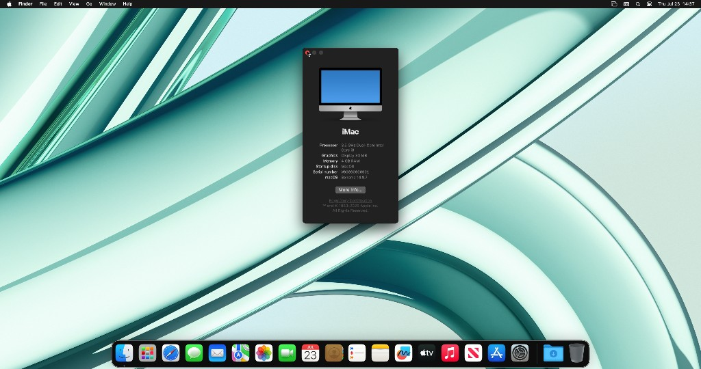
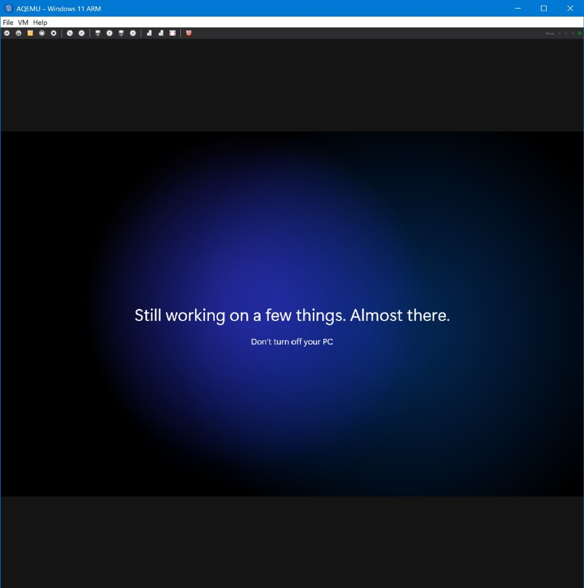
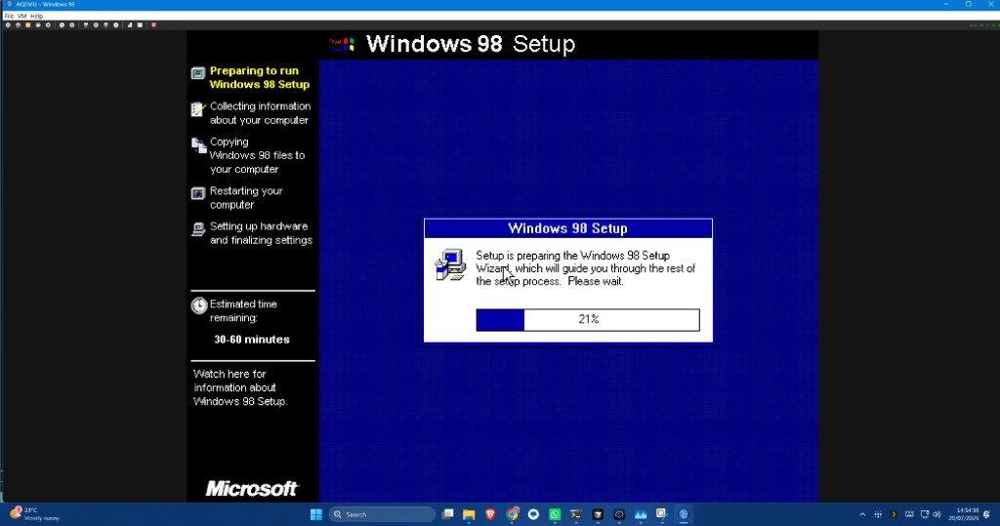
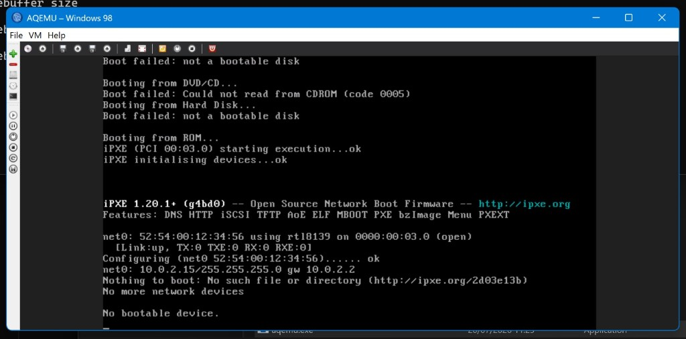

# AQEMU

<p align="center">
  
</p>

<p align="center">
  <b>The QEMU frontend that refused to stay dead.</b><br/>
  Everything QEMU can do — in a modern GUI — with embedded SPICE, guided wizards, and optional QEMU <b>11.0.2</b> built in.<br/>
  Maintained by <a href="https://github.com/chronic8000">Chronic Engineering</a>
</p>

<p align="center">
  <a href="LICENSE"></a>
  <a href="https://github.com/chronic8000/aqemu/releases"></a>
  <a href="https://github.com/chronic8000/aqemu"></a>
  <a href="PRIVACY.md"></a>
</p>

<p align="center">
  
</p>

<p align="center">
  <i>macOS Sonoma 14 in AQEMU — real guest desktop, About This Mac, host-matching resolution.</i>
</p>

---

## This project is alive again

AQEMU started with **Andrey Rijov (RDron)**, then the community era under **Tobias Gläßer** (Qt5 / 0.9.x). Development went quiet. People still bump into old trees online:

- Historical community GitHub: [tobimensch/aqemu](https://github.com/tobimensch/aqemu) *(history only — not our homepage)*
- Abandoned / third-party mirrors (including old SourceForge pages) — **not operated by us**

**Chronic Engineering picked it up.** This is the active fork:

### https://github.com/chronic8000/aqemu

New hosts. New wizards. Embedded SPICE. Win11 ARM. Win9x done properly. Classic Mac + experimental Intel macOS. Optional WSL/KVM. Vendored **QEMU 11.0.2**. Free GitHub Release zips for now; **Microsoft Store** (with updates) when certification clears.

We keep the original authors’ names. We do **not** inherit their old donation pages, crowdfunding, or SourceForge homepage.

| | |
|--|--|
| **Home** | https://github.com/chronic8000/aqemu |
| **Issues** | https://github.com/chronic8000/aqemu/issues |
| **Releases** | https://github.com/chronic8000/aqemu/releases |
| **License** | [GNU GPLv2](LICENSE) |
| **Privacy** | [PRIVACY.md](PRIVACY.md) |
| **Authors** | [AUTHORS](AUTHORS) |

---

## The pitch: everything QEMU does — with a GUI

QEMU already speaks almost every guest architecture and machine type under the sun. AQEMU’s job is to **stop making you hand-write 40-flag command lines** and give you:

- A real **desktop app** (Qt5) on **Windows** and **Linux** (including **Raspberry Pi 5**)
- **Embedded sessions**: QEMU runs headless (`-display none`); you see the guest through **modern SPICE** (plus QMP control) inside AQEMU’s window — not a separate SDL window you lose track of
- **First-start discovery** of every `qemu-system-*` on the machine
- **Wizards and profiles** for the guests people actually fight with in 2026
- **More coming** — deeper session UX, packaging, Store builds, richer Mac / ARM flows

If QEMU can boot it, AQEMU aims to **configure and launch it**. Bring your own ISOs, disks, firmware, and keys where the law requires it.

---

## Windows 11 ARM on x86_64 — yes, really

On a normal **Intel/AMD Windows PC**, an aarch64 guest cannot use WHPX for ARM. AQEMU drives **TCG** with sane defaults (multi-vCPU, VirtIO-oriented Win11 ARM wizard, UEFI/AAVMF discovery, install → first-boot → normal lifecycle).

It is **not as fast as a Pi 5 + KVM** or an ARM laptop. It **is usable**: you can install, update, and work through OOBE in the embedded SPICE view (see [Screenshots](#screenshots)). Perfect for testing ARM Windows without buying ARM hardware.

On **Raspberry Pi 5 / Linux aarch64** hosts, the same profile can lean on **KVM** where available — much snappier.

---

## Windows from 1.x through modern

| Era | What AQEMU helps with |
|-----|------------------------|
| **Windows 1.x / 2.x / 3.x** | Period-friendly PC settings; treat them as real vintage targets |
| **Windows 95 / 98 / ME** | **Force pure TCG** (WHPX hangs classic 9x at splash), pentium2-class CPU, PS/2 or USB tablet guidance, cirrus-era video defaults |
| **NT / 2000 / XP / Vista / 7 / 10 / 11** | Modern q35 / virtio paths where appropriate; full device manager |
| **Windows 11 ARM** | Dedicated wizard + lifecycle modes, VirtIO, UEFI, embedded SPICE |

From **Win9x setup screens** to **Windows 11 ARM “Almost there”** — same app, same session chrome.

---

## Mac guests — classic and modern (bring your own media)

### Classic Mac OS (PowerPC)

- `qemu-system-ppc` + **mac99** (G3 beige still available in the machine list)
- Tuned RAM defaults (e.g. 256 MB for 7–9, 512 MB for OS X PPC)
- New-World-friendly NIC hints (`sungem` / macio when probed), screamer audio hint, machine-native video
- **You supply** the boot CD/ISO or HDD image — we never ship Apple install media
- Clear warning if `qemu-system-ppc` isn’t installed

### Intel macOS / Darwin (experimental)

- `qemu-system-x86_64`, **q35**, dual-pflash **OVMF**, OpenCore as first disk, Apple SMC **only if you paste your own OSK**
- Optional Recovery/BaseSystem path
- Native **WHPX** on Windows, or **WSL/KVM** when `/dev/kvm` works (`wsl.exe` + Linux QEMU, SPICE still on localhost)
- Host-matching resolution via OpenCore; AMD Metal passthrough UI on bare-metal Linux (see [`docs/intel-macos-gpu.md`](docs/intel-macos-gpu.md))
- **AQEMU does not ship** OpenCore, OVMF bundles as Apple IP, OS images, or a pre-filled OSK

### Out of scope (for now)

Apple Silicon macOS guests on Snapdragon Windows hosts — not this release’s promise. Everything else QEMU can express stays on the table via architecture / machine pickers.

---

## Screenshots

More of the guest zoo — Win11 ARM and classic Windows under the same session UI. (Sonoma teaser is at the top of this README.)

**Windows 11 ARM** running *inside* AQEMU on a Windows host — embedded SPICE session, full toolbar, guest progressing through setup:



**Windows 98** install under the same modern UI — classic guests are first-class, not an afterthought:



**Session chrome** — boot console / toolbar while QEMU runs headless behind SPICE:



More captures live in [`screenshots/`](screenshots/).

---

## Built-in QEMU 11.0.2

Optional **git submodule** pins upstream QEMU at **v11.0.2** (`third_party/qemu`). Build scripts for Linux/Pi and Windows produce an install tree you can **bundle next to AQEMU** (`AQEMU_BUNDLE_QEMU=ON`).

One frontend. Current QEMU. Your guests.

Details: [`third_party/README.md`](third_party/README.md).

---

## Feature highlights

- **Embedded SPICE + QMP** session UI (CD/FD/HDD/USB/net toolbar while the guest runs)
- **Full arch discovery** — every `qemu-system-*` QEMU exposes
- **Windows 11 ARM** guided install / first boot / normal modes
- **Force pure TCG** for pre-ME Windows that WHPX breaks
- **Classic PPC Mac** + **experimental Intel macOS** profiles
- **WSL/KVM launch** path on Windows (probe `/dev/kvm` in Settings)
- **Pi 5** optimizations (`-mcpu=cortex-a76`, 64KB page alignment, Wayland)
- **Mouse/pointer** controls (PS/2, USB tablet, VirtIO, VMware mouse, USB controller version)
- **Microsoft Store–ready** posture: GPLv2 source public, [privacy policy](PRIVACY.md), no proprietary OS media in the box

---

## License & what we never ship

**GNU GPL version 2** — [`LICENSE`](LICENSE). Selling installers (Store, itch, Releases) is allowed; source for those binaries is this repo.

We **never** ship:

- Windows ISOs / product keys  
- Apple OS / recovery / BaseSystem  
- OpenCore images  
- A default Apple **OSK**

You point at files you obtained lawfully.

**Trademarks:** Microsoft, Windows, Apple, macOS, etc. belong to their owners. AQEMU is independent and not endorsed by Microsoft, Apple, or the QEMU project.

---

## Install

### GitHub Releases (free portable builds — no auto-updates)

https://github.com/chronic8000/aqemu/releases

Until the **Microsoft Store** listing is live, you can grab a free Windows portable zip from GitHub Releases. That is intentional so people who cannot compile from source still have something to run.

**Important:** GitHub Release builds are **point-in-time downloads**. They do **not** receive automatic updates from GitHub. When a newer zip appears, you install it yourself. Once AQEMU is published on the **Microsoft Store**, that channel is where Windows users should install for **Store-managed updates** (after Microsoft validation / certification). The Store build is the same GPLv2 project; privacy → [PRIVACY.md](PRIVACY.md).

**Windows (portable zip):**

1. Download `aqemu-*-win64.zip` from Releases
2. Unzip anywhere and run `aqemu.exe` (QEMU 11.0.2 binaries + UEFI firmware are bundled in the zip)
3. Complete **First Start** if prompted

**Linux / Raspberry Pi:** build from source for now (see below), or use a `.deb` when one is attached to a release.

### Microsoft Store (coming)

Same GPLv2 code, Store updates, privacy URL → [PRIVACY.md](PRIVACY.md). Prefer the Store once it ships if you want ongoing updates without hunting zips.

---

## Build

### Linux

```bash
sudo apt update
sudo apt install -y build-essential cmake ninja-build pkg-config \
  qtbase5-dev libqt5widgets5 libvncserver-dev extra-cmake-modules \
  libspice-client-glib-2.0-dev qemu-system qemu-utils

git clone --recursive https://github.com/chronic8000/aqemu.git
cd aqemu && mkdir build && cd build
cmake -G Ninja -DAQEMU_WITH_SPICE_GTK=ON ..
ninja && ./aqemu
```

### Raspberry Pi 5

```bash
cmake -G Ninja -DPI5_OPTIMIZATIONS=ON -DAQEMU_WITH_SPICE_GTK=ON ..
# QT_QPA_PLATFORM=wayland aqemu
```

### Windows

**WinLibs UCRT MinGW** + **Qt 5.15**; SPICE from **MSYS2 ucrt64** via `PKG_CONFIG_PATH` only.

```powershell
$env:PKG_CONFIG_PATH = "C:\msys64\ucrt64\lib\pkgconfig"
mkdir build_win -Force; cd build_win
cmake -G Ninja `
  -DCMAKE_PREFIX_PATH="C:/Qt/5.15.2/mingw81_64" `
  -DAQEMU_WITH_SPICE_GTK=ON `
  ..
ninja
.\aqemu.exe
```

### Bundle QEMU 11.0.2

```bash
git submodule update --init --depth 1 third_party/qemu
# Linux: scripts/build_qemu_linux.sh
# Windows MSYS2: scripts/build_qemu_windows_msys.sh
cmake -DAQEMU_BUNDLE_QEMU=ON -DAQEMU_QEMU_PREFIX=$PWD/third_party/qemu-install ...
```

| CMake option | Meaning |
|--------------|---------|
| `AQEMU_WITH_SPICE_GTK` | Embedded spice-client-glib viewer |
| `WITHOUT_EMBEDDED_DISPLAY` | Disable LibVNC fallback |
| `AQEMU_BUNDLE_QEMU` | Copy `qemu-system-*` beside AQEMU |
| `PI5_OPTIMIZATIONS` | Cortex-A76 + 64KB alignment |

---

## Credits

- **Current maintainers:** Chronic Engineering  
- **Prior community maintainer:** Tobias Gläßer (0.9.x)  
- **Original author:** Andrey Rijov (RDron)  

Full contributor list: **Help → About → Thanks To**.

---

## Troubleshooting

- **Win11 ARM on x86 Windows** = TCG only → give it RAM + 4 vCPUs and patience; it’s usable, not native-ARM fast  
- **Win95/98 splash freeze** → enable **Force pure TCG**  
- **Classic Mac won’t start** → install `qemu-system-ppc` and attach your own ISO/HDD  
- **Intel macOS** → your OpenCore + OVMF + OSK; empty OSK refuses to start (by design)  
- **Guest disk locked on Windows** → end stray `qemu-system-*` in Task Manager, restart AQEMU  

---

**AQEMU is not abandonware anymore.** Clone it, build it, boot something ridiculous, and open an issue when QEMU can do it but the GUI can’t — yet.
