<p align="center">
# AQEMU


  <b>AQEMU is a graphical virtual machine manager for QEMU that lets you create and run virtual machines without memorising complex command-line options.</b>
</p>

<p align="center">
  
</p>

<p align="center">
  <b>The QEMU virtual machine manager built for maximum power and modern ease.</b><br/>
  69k+ additions beyond the legacy community tree — probe-driven hardware catalogs, embedded displays, QMP, bundled QEMU <b>11.0.2</b>, and 193 guest profiles.<br/>
  <b>Now Available on the Microsoft Store!</b><br/>
  Maintained by <a href="https://github.com/chronic8000">Chronic Engineering</a>
</p>

<p align="center">
  <a href="LICENSE"></a>
  <a href="https://apps.microsoft.com/detail/9p0hgkhq9w19"></a>
  <a href="https://neonsovereign.store/aqemu.html"></a>
  <a href="https://github.com/chronic8000/aqemu"></a>
  <a href="https://github.com/chronic8000/aqemu"></a>
  <a href="PRIVACY.md"></a>
</p>

<p align="center">
  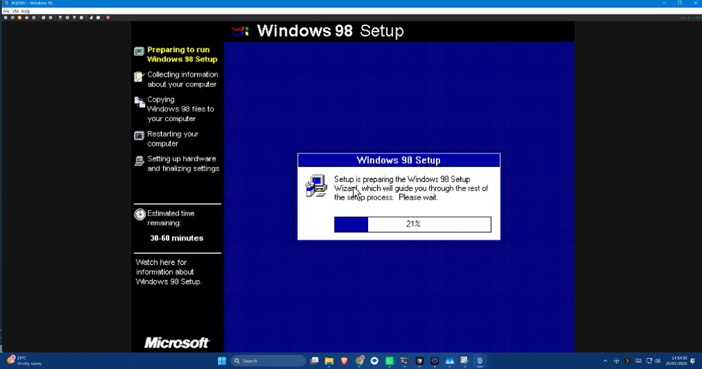
</p>

<p align="center">
  <i>AQEMU VM Manager on Windows — high-fidelity emulation with built-in QEMU 11.0.2 & embedded SPICE display.</i>
</p>

---

## 🛒 Get AQEMU VM Manager

AQEMU is open-source under the **GNU General Public License v2 (GPL-2.0)**. You can freely compile the source code yourself or build custom packages anytime! 

If you want to support ongoing development, maintenance, and future feature releases while enjoying seamless automatic updates directly on Windows, purchase **AQEMU VM Manager** on the Microsoft Store:

<p align="center">
  <a href="ms-windows-store://pdp/?productid=9P0HGKHQ9W19">
    <b>👉 Open in Microsoft Store app (`ms-windows-store://pdp/?productid=9P0HGKHQ9W19`)</b>
  </a><br/>
  <a href="https://apps.microsoft.com/detail/9p0hgkhq9w19">
    <b>🌐 View on Web (`https://apps.microsoft.com/detail/9p0hgkhq9w19`)</b>
  </a>
</p>

---

## Help us test & refine

| | |
|--|--|
| **Microsoft Store** | [AQEMU VM Manager on Microsoft Store](https://apps.microsoft.com/detail/9p0hgkhq9w19) (Official Windows installation with automatic updates) |
| **Website** | [AQEMU Official Website](https://neonsovereign.store/aqemu.html) |
| **File bugs** | [GitHub Issues](https://github.com/chronic8000/aqemu/issues) — host OS, guest OS, and exact log outputs help us triage quickly. Historical [tobimensch/aqemu issues](https://github.com/tobimensch/aqemu/issues) are archived context only; triage lives in [`docs/TOBIMENSCH_ISSUE_TRIAGE.md`](docs/TOBIMENSCH_ISSUE_TRIAGE.md) |
| **What we care about** | Install wizards, embedded SPICE, Win9x/XP TCG, Win11 ARM, Intel macOS, Solaris x86, AIX/pseries, migrate/QMP tools |

---

## This project is alive again

AQEMU started with **Andrey Rijov (RDron)**, then the community era under **Tobias Gläßer** (Qt5 / 0.9.x). Development went quiet. People still bump into old trees online:

- Historical community GitHub: [tobimensch/aqemu](https://github.com/tobimensch/aqemu) *(history only — not our homepage)*
- Abandoned / third-party mirrors (including old SourceForge pages) — **not operated by us**

**Chronic Engineering picked it up.** This is the active project repository:

### https://github.com/chronic8000/aqemu

Compared to [tobimensch/aqemu](https://github.com/tobimensch/aqemu): **probe-driven QEMU catalogs**, **five-path VM creation**, **embedded SPICE/VNC sessions**, **bundled QEMU 11.0.2**, **Win11 ARM**, proper **Win9x TCG**, **classic Mac + Intel macOS** (WSL/KVM), Solaris/AIX/OS/2 recipes, QMP/blockdev/migrate UI, Windows packaging + **Microsoft Store**.

This is not a reskin. Measured from the final inactive upstream baseline, the revival represents approximately:

- **69,000 additions / 2,400 deletions**
- **250+ changed files** and **100+ fork-era commits**
- **30 merged pull requests**
- **193 curated guest OS profiles**
- **29 selectable QEMU target architectures**
- Probe data covering **28 architectures, 490 machines, 2,074 CPUs, 604 NICs and 194 display models**

The work reaches through QEMU discovery, command generation, device compatibility, VM persistence, process supervision, display transport, runtime control, migration, packaging and the creation wizard. The interface changed because the system underneath it changed.

We keep the original authors’ names. We do **not** inherit their old donation pages, crowdfunding, or SourceForge homepage.

| | |
|--|--|
| **Home** | https://github.com/chronic8000/aqemu |
| **Store** | https://apps.microsoft.com/detail/9p0hgkhq9w19 |
| **Website** | https://neonsovereign.store/aqemu.html |
| **Issues** | https://github.com/chronic8000/aqemu/issues |
| **Discussions** | https://github.com/chronic8000/aqemu/discussions |
| **License** | [GNU GPLv2](LICENSE) |
| **Privacy** | [PRIVACY.md](PRIVACY.md) |
| **Authors** | [AUTHORS](AUTHORS) |

---

## What’s new vs the old AQEMU (tobimensch / ~0.9.x)

The last widely known community tree — [tobimensch/aqemu](https://github.com/tobimensch/aqemu) — went quiet in 2020 (Qt5 port, VNC-era display, you brought your own QEMU). **Calling this revival a reskin misses nearly all of the engineering.** AQEMU 1.1.0 changes the capability model, runtime architecture, VM creation flow, platform support and distribution pipeline—not just the appearance.

### 1. Ground-truth capability engine

AQEMU now consumes generated QEMU 11.0.2 probe catalogs instead of assuming that PC hardware exists on every target. The checked-in data covers **28 architectures, 490 machines, 2,074 CPUs, 604 network models and 194 display models**. It is merged with live QEMU discovery and used to validate architecture, machine, CPU, disk bus, NIC, video and audio choices.

The two UI paths intentionally serve different users:

- The **wizard** uses conservative, guest-compatible recommendations.
- The **main configuration and Custom flow** expose the complete probed machine/CPU/NIC/display lists.

This prevents combinations such as PC floppy controllers on non-PC boards or Intel HDA on machines that cannot provide it, while preserving valid expert choices.

### 2. Five creation paths and 193 guest profiles

The rebuilt wizard can start from a **Guest OS**, **System/Board**, **CPU Architecture**, **Custom/Advanced configuration**, or **Existing Disk**. It supports ISO and disk import, URL downloads, kernel/initrd network installs, ISO9660 identification and optional `osinfo-detect`.

Its 193 profiles span DOS and Windows 1.x through Windows 11 ARM, Linux/BSD, Haiku, ReactOS, OS/2, Solaris, AIX, IRIX, HP-UX, classic Mac, PowerPC OS X, experimental Intel macOS, RISC-V, IBM Z and embedded boards. Profiles carry architecture-aware machine, CPU, memory, storage, video, input, audio, NIC and boot recommendations.

### 3. Built-in QEMU 11.0.2

Old AQEMU assumed a system QEMU install. The portable and Store builds can ship a complete runtime beside `aqemu.exe`: all packaged `qemu-system-*` targets, `qemu-img`, `qemu-io`, `qemu-nbd`, firmware, ROMs and runtime libraries. Users can switch between **built-in QEMU** and an explicit **custom QEMU folder**.

### 4. Embedded sessions and a new runtime architecture

QEMU can run headless while AQEMU embeds the guest through **SPICE** or **LibVNCClient**, with native SDL/GTK routing where appropriate. The session UI provides fullscreen mode, removable-media controls, USB hotplug, serial console, power controls, Ctrl+Alt+Del, Shift+F10 and drive activity.

An asynchronous **QMP client** drives pause/resume, ACPI shutdown, reset, media changes, block queries and live migration. Monitor ports are dynamically allocated outside Hyper-V's reserved ranges, and QEMU output is captured so launch failures are shown instead of disappearing in a separate process.

### 5. Guests people fight with today — with recipes that work
| Guest | What we added |
|--|--|
| **Windows 11 ARM** | Wizard + lifecycle on **x64 Windows hosts via TCG** (and KVM on Pi 5 / aarch64) |
| **Windows 95 / 98 / ME** | **Force pure TCG** — WHPX hangs classic 9x; we stop that footgun |
| **Intel macOS** | OpenCore + OVMF + OSK UI, host-matching resolution, optional **WSL/KVM** on Windows |
| **Classic Mac OS (PPC)** | `mac99` / PowerPC profiles, no PC floppy nonsense |
| **Solaris 11.4 / AIX / OS/2 / ReactOS** | Wizard defaults matching real QEMU flags (AIX = `ppc64`/`pseries`, TCG on Windows) |

### 6. Deeper QEMU without living in a shell

Advanced Options grew serious CLI coverage: **SMP topology, NUMA, memory backends, I/O threads, TPM, watchdog, secrets, UUID, SMBIOS, fw_cfg, audiodev, icount, sandboxing**, richer chardev/netdev/blockdev hooks, a **blockdev graph editor**, incoming migration and raw Additional Arguments.

Storage tooling now covers image creation, backing files, conversion, compression, inspection, cloning and multiple IDE/AHCI/SCSI/VirtIO/NVMe/floppy/SD/MTD/pflash devices. Networking covers user/NAT forwarding, bridge, TAP, sockets, multicast, VDE, TFTP, SMB and modern `-netdev`/`-device` generation.

### 7. Acceleration that respects the guest architecture

AQEMU distinguishes explicit **TCG**, native acceleration and Xen. On Windows, the native path maps compatible x86 guests to WHPX/HAX with fallback; selecting TCG means pure TCG. Cross-architecture guests stay on TCG rather than being silently pushed toward an accelerator that cannot execute them.

Compatibility guardrails handle vintage Windows guests that hang under WHPX, non-x86 guests on x86 hosts and KVM-capable AArch64 Linux hosts. Configuration refreshes preserve user-selected accelerator, machine and CPU values instead of resetting them to the first list entry.

### 8. Windows, Linux and Pi hosts that match how people work
- **WHPX** when the guest arch allows it; **never** shoved onto PPC/ARM guests that cannot use it  
- **WSL/KVM** launch path for heavy guests (Intel macOS) when `/dev/kvm` is there  
- **Raspberry Pi 5** build flags and aarch64 friendliness  
- Store-safe writable data under `%LOCALAPPDATA%`

### 9. A complete Windows distribution pipeline

The repository now builds a portable application, WiX MSI and signed full-trust MSIX. Packaging stages QEMU, firmware, plugins and dependencies and validates that required runtime pieces are present. The Microsoft Store package adds managed installation and updates while the GPLv2 source remains public.

### 10. Still AQEMU—just alive

The project remains a QEMU frontend and manager, not a replacement hypervisor. It keeps the original GPLv2 mission and credits while modernizing nearly every layer needed to make that mission practical in 2026. Issues, Discussions and pull requests are open to everyone with a GitHub account.

Full chronology: [`CHANGELOG`](CHANGELOG). Historical tree (not our homepage): [tobimensch/aqemu](https://github.com/tobimensch/aqemu).

---

## The pitch: QEMU's power—without hand-writing every command

QEMU already speaks almost every guest architecture and machine type under the sun. AQEMU’s job is to **stop making you hand-write 40-flag command lines** and give you:

- A real **desktop app** (Qt5) on **Windows** and **Linux** (including **Raspberry Pi 5**)
- **Embedded SPICE + QMP** sessions — guest display and controls in one window
- **Built-in or custom QEMU** — portable zip includes **11.0.2**
- **Wizards and profiles** for Win9x → Win11 ARM, classic Mac, Intel macOS, Solaris, AIX, and more
- **Active maintenance** — this is the fork that ships builds and wants your bug reports

If QEMU can boot it, AQEMU aims to **configure and launch it**. Bring your own ISOs, disks, firmware, and keys where the law requires it.

---

## Windows 11 ARM on x86_64 — yes, really

On a normal **Intel/AMD Windows PC**, an aarch64 guest cannot use WHPX for ARM. AQEMU drives **TCG** with sane defaults (multi-vCPU, VirtIO-oriented Win11 ARM wizard, UEFI/AAVMF discovery, install → first-boot → normal lifecycle).

It is **not as fast as a Pi 5 + KVM** or an ARM laptop. It **is usable**: you can install, update, and work through OOBE in the embedded SPICE view (see [Screenshots](#screenshots)). Perfect for testing ARM Windows without buying ARM hardware.

On **Raspberry Pi 5 / Linux aarch64** hosts, the same profile can lean on **KVM** where available — much snappier.

<p align="center">
  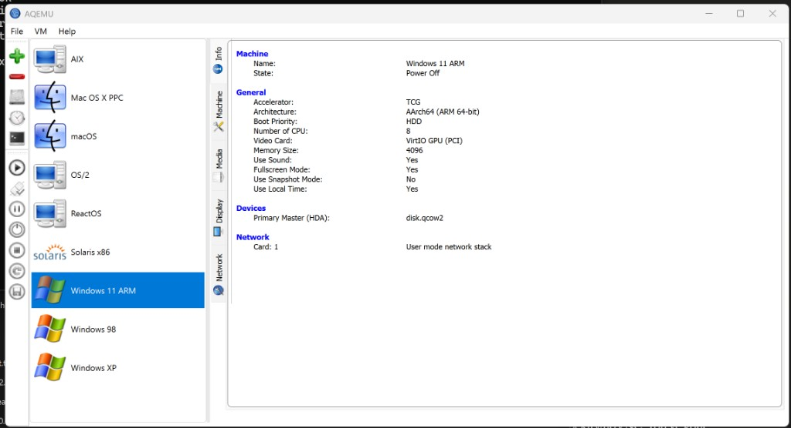
  <br/><i>AQEMU keeps the complete Windows 11 ARM machine profile visible: AArch64, TCG, VirtIO GPU, UEFI and lifecycle mode.</i>
</p>

---

## Windows from 1.x through modern

| Era | What AQEMU helps with |
|-----|------------------------|
| **Windows 1.x / 2.x / 3.x** | Period-friendly PC settings; treat them as real vintage targets |
| **Windows 95 / 98 / ME** | **Force pure TCG** (WHPX hangs classic 9x at splash), pentium2-class CPU, PS/2 or USB tablet guidance, cirrus-era video defaults |
| **NT / 2000 / XP / Vista / 7 / 10 / 11** | Modern q35 / virtio paths where appropriate; full device manager |
| **Windows 11 ARM** | Dedicated wizard + lifecycle modes, VirtIO, UEFI, embedded SPICE |

From **Win9x setup screens** to **Windows 11 ARM “Almost there”** — same app, same session chrome.

<p align="center">
  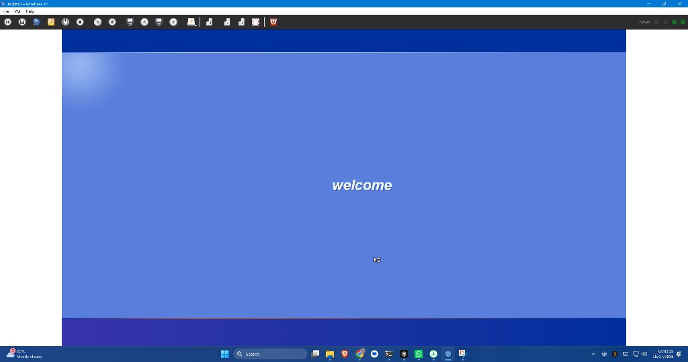
  <br/><i>Windows XP booting inside AQEMU's embedded session—vintage guests remain first-class targets.</i>
</p>

---

## Unix & other heavy guests

| Guest | Notes |
|-------|--------|
| **Solaris 11.4 x86** | Text installer ISO, `pc` + `usb=off`, e1000, IDE, WHPX/KVM on Windows; install can sit at 99% for a long time while the disk grows |
| **AIX (POWER)** | `qemu-system-ppc64` + `pseries` + POWER8, **TCG only** on x86 hosts (very slow). Virtio-SCSI. VMware VMDKs often fail under SLOF (`E3403 Bad executable`) — prefer a real AIX install ISO |
| **OS/2 / eComStation / ReactOS** | Proven IDE / ACPI-off / Force TCG style defaults in the wizard |
| **Linux / BSD / Haiku / …** | Full arch + machine pickers; VirtIO where it makes sense |

---

## Mac guests — classic and modern (bring your own media)

### Classic Mac OS (PowerPC)

- `qemu-system-ppc` + **mac99** (G3 beige still available in the machine list)
- Tuned RAM defaults (e.g. 256 MB for 7–9, 512 MB for OS X PPC)
- New-World-friendly NIC hints (`sungem` / macio when probed), screamer audio hint, machine-native video
- **You supply** the boot CD/ISO or HDD image — we never ship Apple install media
- Clear warning if `qemu-system-ppc` isn’t installed

<p align="center">
  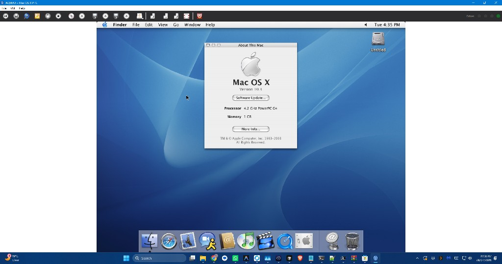
  <br/><i>Mac OS X Tiger on an emulated PowerPC G4, running inside AQEMU on Windows.</i>
</p>

### Intel macOS / Darwin (experimental)

- `qemu-system-x86_64`, **q35**, dual-pflash **OVMF**, OpenCore as first disk, Apple SMC **only if you paste your own OSK**
- Optional Recovery/BaseSystem path
- Native **WHPX** on Windows, or **WSL/KVM** when `/dev/kvm` works (`wsl.exe` + Linux QEMU, SPICE still on localhost)
- Host-matching resolution via OpenCore; AMD Metal passthrough UI on bare-metal Linux (see [`docs/intel-macos-gpu.md`](docs/intel-macos-gpu.md))
- **AQEMU does not ship** OpenCore, OVMF bundles as Apple IP, OS images, or a pre-filled OSK

<p align="center">
  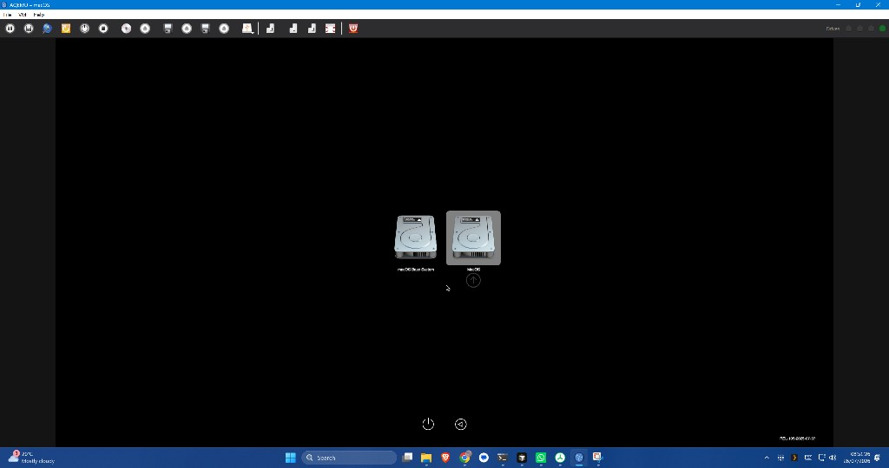
  <br/><i>OpenCore boot selection inside AQEMU—users provide their own lawful OpenCore, firmware and macOS media.</i>
</p>

<p align="center">
  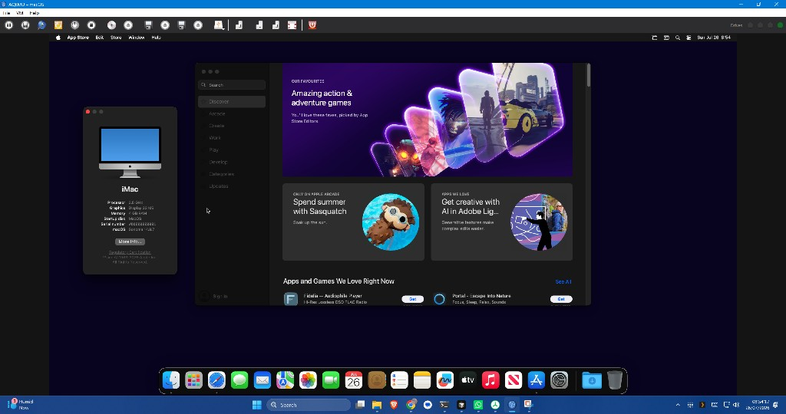
  <br/><i>Intel macOS Sonoma running as an experimental AQEMU guest, with the AQEMU session toolbar still visible.</i>
</p>

### Out of scope (for now)

Apple Silicon macOS guests on Snapdragon Windows hosts — not this release’s promise. Everything else QEMU can express stays on the table via architecture / machine pickers.

---

## 🍏 Apple Silicon (iOS & macOS ARM64) Emulation on Windows

AQEMU now bundles **`qemu-system-applesoc.exe`**, a specialized QEMU binary compiled with **ChefKiss Inferno**, **Apple Secure Enclave (SEP) crypto primitives** (`nettle`/`gmp`), **User NAT networking** (`slirp`), and **LZFSE compressed kernel cache decoding** (`liblzfse`).

AQEMU is the **first hypervisor frontend on Windows** to offer a native UI for probing and configuring Apple Silicon SoC targets (`t8030` A13 Bionic & `s8000` Apple A9)!

### 🚀 How to Run iOS / macOS Apple Silicon in AQEMU

1. **Select iOS or macOS Apple Silicon in the New VM Wizard**:
   - Navigate to **New VM Wizard → Apple → `iOS (ARM64)`** or **`macOS Apple Silicon (ARM64)`**.
   - AQEMU automatically selects **`qemu-system-applesoc`** and sets the machine target to **`t8030` (Apple A13 Bionic - iPhone 11)** with 4 vCPUs, 4GB RAM, and VirtIO networking.
2. **Extract Kernel Cache & Device Tree (`-kernel` and `-dtb`)**:
   - Obtain a legitimate iOS IPSW for iPhone 11 or target Apple device.
   - Extract the `kernelcache` and target hardware `.dtb` device tree blob.
   - Pass `-kernel /path/to/kernelcache` and `-dtb /path/to/device.dtb` in AQEMU's **VM Configuration → Advanced QEMU Options → Additional Command Line Arguments**.
3. **Mount APFS Disk Image (`-drive`)**:
   - Provide an APFS-formatted iOS/macOS system image attached via NVMe (`-device nvme-mmu`).
4. **Launch & Monitor via Embedded SPICE / Serial Console**:
   - Hit **Play**! AQEMU launches `qemu-system-applesoc.exe` in headless SPICE/serial mode, giving you direct control over the booted Apple Silicon environment on your x86_64 Windows PC.

---

## Screenshots

More of the guest zoo — Win11 ARM and classic Windows under the same session UI. (Sonoma teaser is at the top of this README.)

**Windows 11 ARM** running *inside* AQEMU on a Windows host — embedded SPICE session, full toolbar, guest progressing through setup:

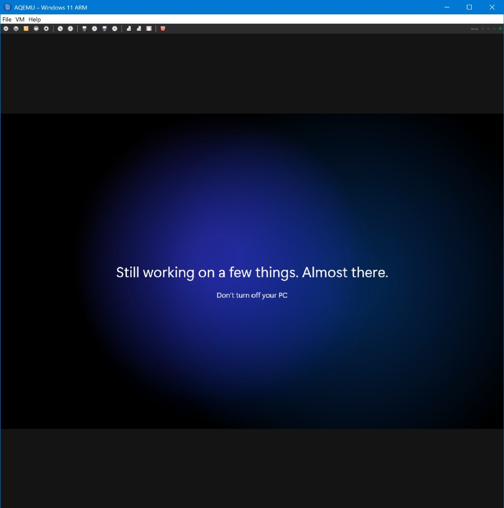

**Windows 98** install under the same modern UI — classic guests are first-class, not an afterthought:


**Session chrome** — boot console / toolbar while QEMU runs headless behind SPICE:

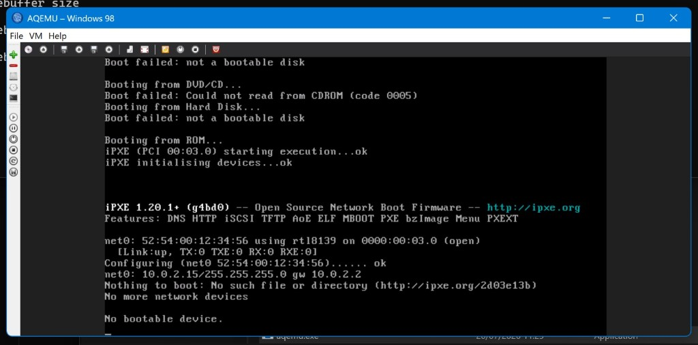

### 🛠️ Overhauled VM Creation Wizard (5 Creation Paths & 29 QEMU Targets)

**1. Creation Method** — Select from 5 creation paths: Guest OS, System/Board Platform, CPU Architecture, Custom/Advanced, or Import Existing Disk:

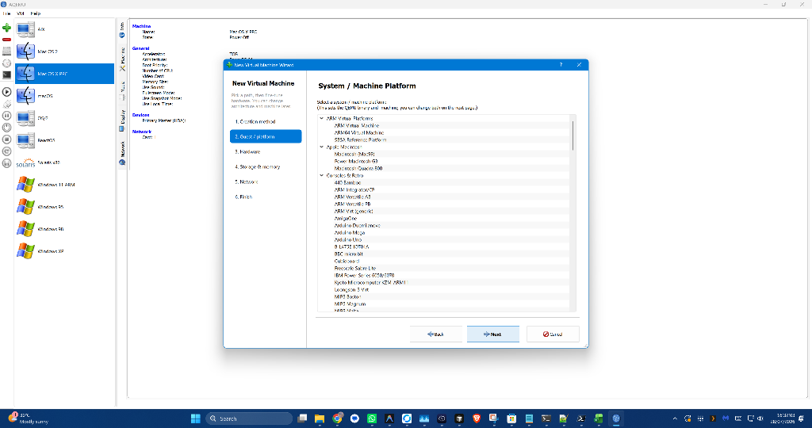

**2. System / Machine Platform** — Categorized boards and hardware platforms (ARM Virt, Apple PowerMac, Sun SPARCstation, Retro/SBCs):

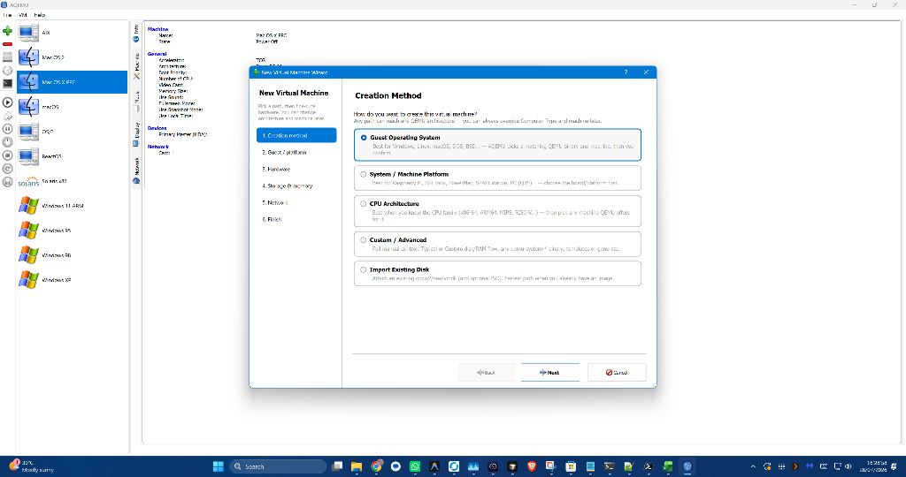

**3. CPU Architecture** — Direct access to all 29 QEMU target executables (x86_64, aarch64, ppc64, riscv64, s390x, sparc, mips, alpha, hppa...):

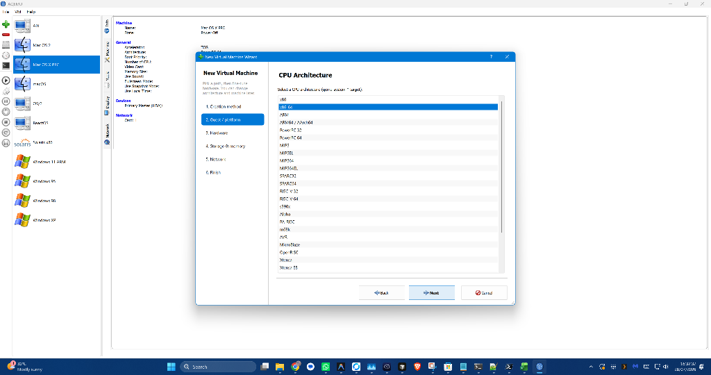

**4. Machine Selection & Ground-Truth Catalog** — Probe-driven machine selection with recommended defaults and complete QEMU machine catalogs:

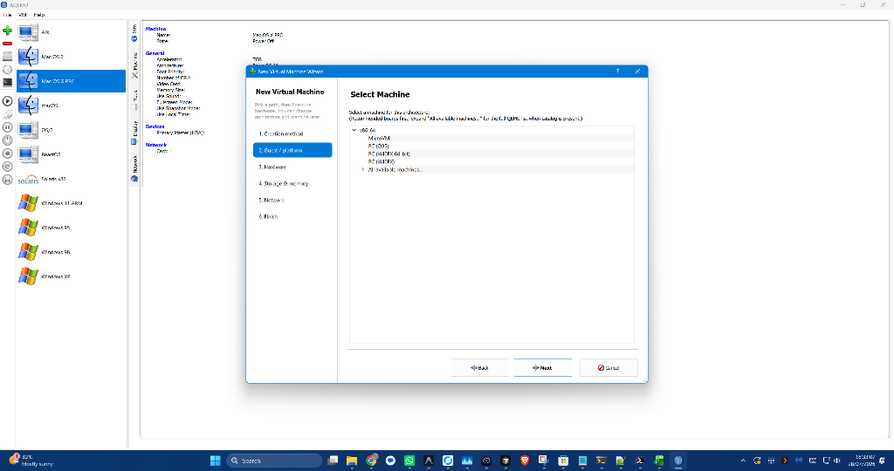

More captures live in [`screenshots/`](screenshots/).

---

## Built-in QEMU 11.0.2

Optional **git submodule** pins upstream QEMU at **v11.0.2** (`third_party/qemu`). Build scripts for Linux/Pi and Windows produce an install tree you can **bundle next to AQEMU** (`AQEMU_BUNDLE_QEMU=ON`).

One frontend. Current QEMU. Your guests.

Details: [`third_party/README.md`](third_party/README.md).

---

## Feature highlights

- **Beyond the old AQEMU** — 69k+ additions across 250+ files; this is an architectural revival, not a reskin
- **Ground-truth catalogs** — 28 probed architectures, 490 machines, 2,074 CPUs, 604 NICs and 194 displays
- **Five-path wizard** — 193 curated guest profiles plus system, architecture, custom and disk-import flows
- **QEMU installation** — **Use built-in QEMU** (portable zip) or **custom folder**
- **Embedded SPICE/VNC + QMP** session UI (CD/FD/HDD/USB hotplug/net toolbar while the guest runs)
- **Full architecture discovery** — 29 selectable QEMU targets plus live `qemu-system-*` discovery
- **Windows 11 ARM** guided install / first boot / normal modes
- **Force pure TCG** for pre-ME Windows that WHPX breaks
- **Classic PPC Mac** + **experimental Intel macOS** (OpenCore / WSL-KVM)
- **Solaris / AIX / OS/2 / ReactOS** wizard defaults that match real QEMU recipes
- **Advanced QEMU options** — NUMA, TPM, migrate, SMBIOS, fw_cfg, blockdev graph, …
- **WSL/KVM launch** path on Windows (probe `/dev/kvm` in Settings)
- **Pi 5** optimizations (`-mcpu=cortex-a76`, 64KB page alignment, Wayland)
- **Microsoft Store–ready** posture: GPLv2 source public, [privacy policy](PRIVACY.md), no proprietary OS media in the box

---

## License & what we never ship

**GNU GPL version 2** — [`LICENSE`](LICENSE). Selling installers (Store, itch, Releases) is allowed; source for those binaries is this repo.

We **never** ship:

- Windows ISOs / product keys  
- Apple OS / recovery / BaseSystem  
- OpenCore images  
- A default Apple **OSK**
- IBM AIX / Oracle Solaris media

You point at files you obtained lawfully.

**Trademarks:** Microsoft, Windows, Apple, macOS, IBM, Oracle, etc. belong to their owners. AQEMU is independent and not endorsed by Microsoft, Apple, IBM, Oracle, or the QEMU project.

---

## Install

### Microsoft Store (Windows)

Get the official **AQEMU VM Manager** package on the Microsoft Store:

<p align="center">
  <a href="ms-windows-store://pdp/?productid=9P0HGKHQ9W19">
    <b>👉 Open in Microsoft Store app (`ms-windows-store://pdp/?productid=9P0HGKHQ9W19`)</b>
  </a><br/>
  <a href="https://apps.microsoft.com/detail/9p0hgkhq9w19">
    <b>🌐 View on Web (`https://apps.microsoft.com/detail/9p0hgkhq9w19`)</b>
  </a>
</p>

The Microsoft Store version includes:
- **Bundled QEMU 11.0.2** binaries (no separate QEMU setup required)
- **Automatic background updates** via the Microsoft Store
- Dedicated Windows app installation & single-click launcher

### Build from Source (Linux / Pi 5 / Windows)

AQEMU is 100% open-source software under **GPLv2**. You can clone and build the application directly from source on Linux, Raspberry Pi 5, or Windows (see [Build instructions](#build) below).

---

## Build

### Linux

```bash
sudo apt update
sudo apt install -y build-essential cmake ninja-build pkg-config \
  qtbase5-dev libqt5widgets5 libvncserver-dev extra-cmake-modules \
  libspice-client-glib-2.0-dev qemu-system qemu-utils

git clone --recursive https://github.com/chronic8000/aqemu.git
cd aqemu && mkdir build && cd build
cmake -G Ninja -DAQEMU_WITH_SPICE_GTK=ON ..
ninja && ./aqemu
```

### Raspberry Pi 5

```bash
cmake -G Ninja -DPI5_OPTIMIZATIONS=ON -DAQEMU_WITH_SPICE_GTK=ON ..
# QT_QPA_PLATFORM=wayland aqemu
```

### Windows

**WinLibs UCRT MinGW** + **Qt 5.15**; SPICE from **MSYS2 ucrt64** via `PKG_CONFIG_PATH` only.

```powershell
$env:PKG_CONFIG_PATH = "C:\msys64\ucrt64\lib\pkgconfig"
mkdir build_win -Force; cd build_win
cmake -G Ninja `
  -DCMAKE_PREFIX_PATH="C:/Qt/5.15.2/mingw81_64" `
  -DAQEMU_WITH_SPICE_GTK=ON `
  ..
ninja
.\aqemu.exe
```

### Bundle QEMU 11.0.2

```bash
git submodule update --init --depth 1 third_party/qemu
# Linux: scripts/build_qemu_linux.sh
# Windows MSYS2: scripts/build_qemu_windows_msys.sh
cmake -DAQEMU_BUNDLE_QEMU=ON -DAQEMU_QEMU_PREFIX=$PWD/third_party/qemu-install ...
```

| CMake option | Meaning |
|--------------|---------|
| `AQEMU_WITH_SPICE_GTK` | Embedded spice-client-glib viewer |
| `WITHOUT_EMBEDDED_DISPLAY` | Disable LibVNC fallback |
| `AQEMU_BUNDLE_QEMU` | Copy `qemu-system-*` beside AQEMU |
| `PI5_OPTIMIZATIONS` | Cortex-A76 + 64KB alignment |

---

## Credits

- **Current maintainers:** Chronic Engineering  
- **Prior community maintainer:** Tobias Gläßer (0.9.x)  
- **Original author:** Andrey Rijov (RDron)  

Full contributor list: **Help → About → Thanks To**.

---

## Troubleshooting

- **Win11 ARM on x86 Windows** = TCG only → give it RAM + 4 vCPUs and patience; it’s usable, not native-ARM fast  
- **Win95/98 splash freeze** → enable **Force pure TCG**  
- **Classic Mac won’t start** → install `qemu-system-ppc` and attach your own ISO/HDD  
- **Intel macOS** → your OpenCore + OVMF + OSK; empty OSK refuses to start (by design)  
- **Solaris 11.4 “stuck”** → often still installing; watch the disk image grow; use text ISO + WHPX/KVM  
- **AIX on Windows** → PPC is TCG-only; dead keyboard at OF prompt usually means console was forced to serial VTY while you typed in the VGA window  
- **AIX `E3403 Bad executable`** → disk is not a QEMU/SLOF-bootable AIX image (common with VMware VMDKs)  
- **Guest disk locked on Windows** → end stray `qemu-system-*` in Task Manager, restart AQEMU  
- **Clipboard host↔guest** → real sync needs SPICE + `spice-vdagent` *in the guest*; AIX/SLOF and many vintage guests will not do that  

Questions and patches: [GitHub Issues](https://github.com/chronic8000/aqemu/issues) / PRs welcome.
