<p align="center">
# AQEMU


  <b>AQEMU is a graphical virtual machine manager for QEMU that lets you create and run virtual machines without memorising complex command-line options.</b>
</p>

<p align="center">
  
</p>

<p align="center">
  <b>The QEMU virtual machine manager built for maximum power and modern ease.</b><br/>
  118k additions beyond Tobias Gläßer’s 0.9.x tree — probe-driven hardware catalogs, embedded displays, QMP, bundled QEMU <b>11.0.2</b>, and 195 guest profiles.<br/>
  <b>Now Available on the Microsoft Store!</b><br/>
  Maintained by <a href="https://github.com/chronic8000">Chronic Engineering</a> • <a href="https://chronic8000.github.io/aqemu">chronic8000.github.io/aqemu</a>
</p>

<p align="center">
  <a href="LICENSE"></a>
  <a href="https://apps.microsoft.com/detail/9p0hgkhq9w19"></a>
  <a href="https://ko-fi.com/chronicengineering"></a>
  <a href="https://paypal.me/chronicengineering"></a>
  <a href="#-sponsor--donate"></a>
  <a href="https://github.com/chronic8000/aqemu"></a>
  <a href="https://github.com/chronic8000/aqemu"></a>
  <a href="https://github.com/chronic8000/aqemu"></a>
  <a href="PRIVACY.md"></a>
</p>

<p align="center">
  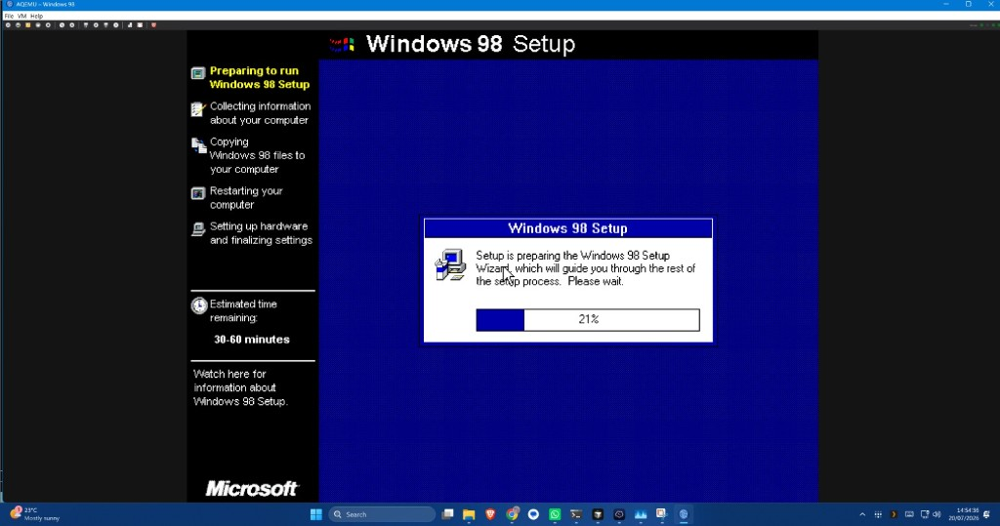
</p>

<p align="center">
  <i>AQEMU VM Manager on Windows — high-fidelity emulation with built-in QEMU 11.0.2 & embedded SPICE display.</i>
</p>

---

## 🛒 Get AQEMU VM Manager

AQEMU is open-source under the **GNU General Public License v2 (GPL-2.0)**. You can freely compile the source code yourself or build custom packages anytime! 

If you want to support ongoing development, maintenance, and future feature releases while enjoying seamless automatic updates directly on Windows, purchase **AQEMU VM Manager** on the Microsoft Store:

<p align="center">
  <a href="https://chronic8000.github.io/aqemu">
    <b>🌐 Visit the Official Website & Feature Tour: https://chronic8000.github.io/aqemu</b>
  </a><br/><br/>
  <a href="ms-windows-store://pdp/?productid=9P0HGKHQ9W19">
    <b>👉 Open in Microsoft Store app (`ms-windows-store://pdp/?productid=9P0HGKHQ9W19`)</b>
  </a><br/>
  <a href="https://apps.microsoft.com/detail/9p0hgkhq9w19">
    <b>🌐 View on Web (`https://apps.microsoft.com/detail/9p0hgkhq9w19`)</b>
  </a>
</p>

### 🛍️ Microsoft Store Purchasing & Offline Licensing FAQ

If you have never purchased software through the Microsoft Store before, here is a transparent breakdown of how purchasing, installation, and licensing work for **AQEMU VM Manager**:

- **Account Only Needed for Initial Install**:
  You only need to be signed in to your Microsoft Account (MSA) in the Microsoft Store app or browser to complete the purchase and download AQEMU.
- **100% Offline Capability — Zero DRM or Telemetry**:
  Once AQEMU is installed on your Windows machine, **you do NOT need to be online to use the software**. AQEMU runs completely offline with no phone-home mechanisms, no recurring license checks, and zero background connectivity requirements.
- **Logging Out of the Store**:
  After installing AQEMU, you can log out of your Microsoft Account in the Microsoft Store app or Windows if you wish. AQEMU remains fully installed, licensed, and operational on that device.
- **Multiple PC Installs**:
  Your single purchase allows you to install AQEMU on up to 10 Windows 10/11 devices associated with your Microsoft Account without paying again.
- **Automatic & Safe Background Updates**:
  Whenever a new release of AQEMU is published, the Microsoft Store automatically downloads and applies updates seamlessly without overwriting your virtual machines, disks, or custom configurations.
- **Full Open-Source Freedom (GPLv2)**:
  AQEMU is 100% Free and Open Source Software licensed under the GNU GPLv2. Purchasing on the Microsoft Store directly supports active engineering and ongoing feature development, while the complete source code remains freely available on GitHub.

---

## 💖 Sponsor & Donate

AQEMU is 100% free and open-source software. If AQEMU has saved you time, made your virtualization workflows effortless, or if you simply want to support independent open-source engineering, ongoing releases, and new hardware profiles, donations are warmly appreciated!

### ☕ Traditional & One-Off Payments

| Platform | Link / Details | Supported Payment Methods |
| :--- | :--- | :--- |
| **Ko-fi** | [](https://ko-fi.com/chronicengineering) | Credit/Debit Card, Apple Pay, Google Pay, PayPal (0% platform fee) |
| **PayPal** | [](https://paypal.me/chronicengineering) | Direct PayPal Transfer / Balance |
| **Microsoft Store** | [](https://apps.microsoft.com/detail/9p0hgkhq9w19) | One-time purchase with automatic Windows background updates |

### 🪙 Cryptocurrency Wallets

You can also send direct cryptocurrency donations to the following public addresses:

- **Bitcoin (BTC)**:
  ```text
  bc1qcatc77vfq24d9csr3g3y4f4lvs7ukr002e42uw
  ```
- **Litecoin (LTC)**:
  ```text
  ltc1q55sea4z9pz33w2nss03na9vd328m4mue4ya6cv
  ```
- **Dogecoin (DOGE)**:
  ```text
  DHQHzd9NExzeUrGZe4jDW6HnJVmQNDZrat
  ```
- **Monero (XMR)**:
  ```text
  83Yt63ZQ4aAda7unczzNzLZ9DFP6RLw2Sev9zcGs4EuS15n6Mgfk1NeejmuBMyuchNSh3AFuUCezEeDGuvbraGo5Qbvuncd
  ```

---

## iOS on Windows 11

**AQEMU is the Windows 11 app that runs iOS in a window.** Nothing else on the Microsoft Store — or as a Windows VM manager — puts a working iPhone guest on a PC like this. Under the hood that is ChefKiss Inferno (`qemu-system-applesoc`); AQEMU is the GUI, restore flow, filesystem patches, hardware buttons, and guest internet that make it usable on Windows.

**Tested today with iOS 14** (setup + SpringBoard on **t8030** / iPhone 11). **Newer iOS versions are the roadmap** as Inferno’s SoC support grows — AQEMU will follow those builds, not freeze on 14.

<p align="center">
  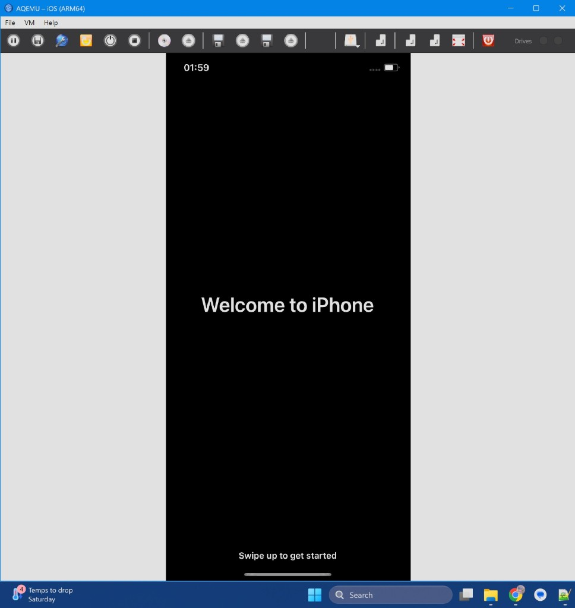
</p>

<p align="center">
  <i>First boot on Windows 11: Setup (“Welcome to iPhone”) inside AQEMU — iOS (ARM64).</i>
</p>

<p align="center">
  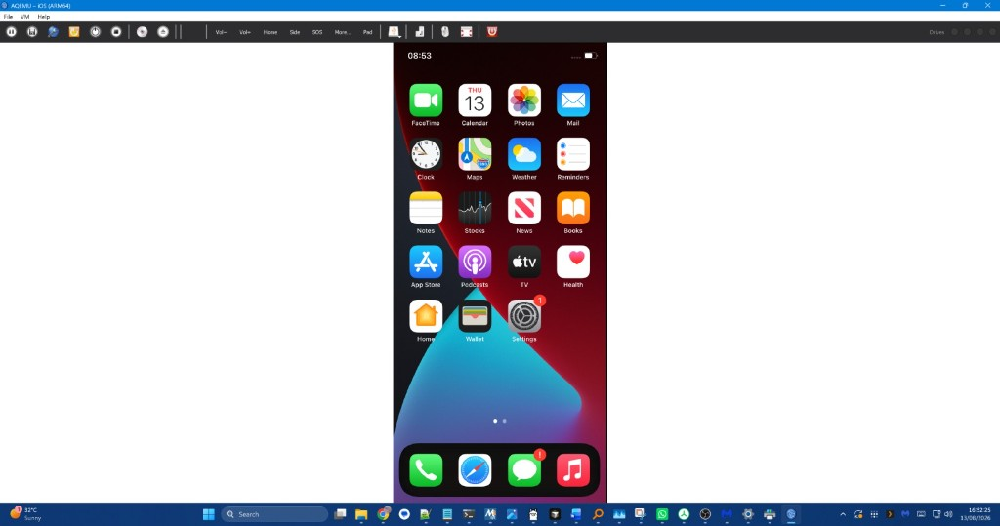
</p>

<p align="center">
  <i>SpringBoard on the desktop: Home, Side, Vol, SOS on the session toolbar — not a fake phone bezel.</i>
</p>

You supply the IPSW and firmware (AQEMU does not ship Apple OS images). After restore, **filesystem patches** are required or the screen stays black. Guest Wi‑Fi is reverse-tether through the companion, not the Network NIC tab.

Full walkthrough (including re-install): [`extras/Inferno/iOS_Installation.md`](extras/Inferno/iOS_Installation.md).

### How to run iOS

1. **New VM Wizard → Apple → iOS (ARM64)** — Inferno `t8030`, 4 vCPUs, ≥4 GB RAM.
2. Fill **kernel**, **DeviceTree** (extracted `.dtb` / `.dec`), trustcache, ticket, SEP, restore ramdisk. **File → iOS Firmware Tool** unpacks the IPSW, forges tickets, and packs SEP with **`img4`** (Windows: `.\scripts\build_img4_windows.ps1`) and DeviceTree IM4P with **`pyimg4`**.
3. USB remote **`127.0.0.1:8030`**. **File → Apple SoC Restore**: start companion, Power On iOS, restore IPSW.
4. **File → Apply iOS filesystem patches…** on the guest `root` disk (not the companion). Then Power On for Setup / SpringBoard.
5. Toolbar **Net** or **File → Guest Internet / iOS Device Tools…** → **Enable guest internet** for Safari / App Store.
6. This path is **TCG on x86 Windows via WSL** — real, but not iPhone-speed. Machine presets: **`t8030`** (A13) and **`s8000`**.

Get it with automatic updates: [AQEMU VM Manager on the Microsoft Store](https://apps.microsoft.com/detail/9p0hgkhq9w19).

---

## Help us test & refine

| | |
|--|--|
| **Microsoft Store** | [AQEMU VM Manager on Microsoft Store](https://apps.microsoft.com/detail/9p0hgkhq9w19) (Official Windows installation with automatic updates) |
| **Releases & Source** | [GitHub Releases](https://github.com/chronic8000/aqemu/releases) / [Repository](https://github.com/chronic8000/aqemu) |
| **File bugs** | [GitHub Issues](https://github.com/chronic8000/aqemu/issues) — host OS, guest OS, and exact log outputs help us triage quickly. Historical [tobimensch/aqemu issues](https://github.com/tobimensch/aqemu/issues) are archived context only; triage lives in [`docs/TOBIMENSCH_ISSUE_TRIAGE.md`](docs/TOBIMENSCH_ISSUE_TRIAGE.md) |
| **What we care about** | **iOS on Windows 11**, install wizards, embedded SPICE, Win9x/XP TCG, Win11 ARM, Intel macOS, Solaris x86, AIX/pseries, migrate/QMP tools |

---

## This project is alive again

AQEMU started with **Andrey Rijov (RDron)**, then the community era under **Tobias Gläßer** (Qt5 / 0.9.x). Development went quiet. People still bump into old trees online:

- Historical community GitHub: [tobimensch/aqemu](https://github.com/tobimensch/aqemu) *(history only — not our homepage)*
- Abandoned / third-party mirrors (including old SourceForge pages) — **not operated by us**

**Chronic Engineering picked it up.** This is the active project repository:

### https://github.com/chronic8000/aqemu

Compared to [tobimensch/aqemu](https://github.com/tobimensch/aqemu): **iOS on Windows 11**, **probe-driven QEMU catalogs**, **six-path VM creation**, **embedded SPICE/VNC sessions**, **bundled QEMU 11.0.2**, **Win11 ARM**, proper **Win9x TCG**, **classic Mac + Intel macOS** (WSL/KVM), Solaris/AIX/OS/2 recipes, QMP/blockdev/migrate UI, Windows packaging + **Microsoft Store**.

Measured against that tree ([compare](https://github.com/tobimensch/aqemu/compare/master...chronic8000:aqemu:master)):

- **118,707 additions / 7,617 deletions** across **416 files** and **197 commits**
- **195 curated guest OS profiles**
- **29 selectable QEMU target architectures**, plus ChefKiss Inferno (`qemu-system-applesoc`) and Reims (`qemu-system-reims3d`)
- Probe data covering **28 architectures, 490 machines, 2,074 CPUs, 604 NICs and 194 display models**

The work reaches through QEMU discovery, command generation, device compatibility, VM persistence, process supervision, display transport, runtime control, migration, packaging and the creation wizard. The interface changed because the system underneath it changed.

We keep the original authors’ names. We do **not** inherit their old donation pages, crowdfunding, or SourceForge homepage.

| | |
|--|--|
| **Website** | https://chronic8000.github.io/aqemu |
| **Home** | https://github.com/chronic8000/aqemu |
| **Store** | https://apps.microsoft.com/detail/9p0hgkhq9w19 |
| **Releases** | https://github.com/chronic8000/aqemu/releases |
| **Issues** | https://github.com/chronic8000/aqemu/issues |
| **Discussions** | https://github.com/chronic8000/aqemu/discussions |
| **License** | [GNU GPLv2](LICENSE) |
| **Privacy** | [PRIVACY.md](PRIVACY.md) |
| **Authors** | [AUTHORS](AUTHORS) |

---

## What’s new vs the old AQEMU (tobimensch / ~0.9.x)

The last widely known community tree — [tobimensch/aqemu](https://github.com/tobimensch/aqemu) — went quiet in 2020 (Qt5 port, embedded VNC, you brought your own QEMU). **AQEMU 1.5.2** is that codebase continued: the same GPLv2 frontend, with the capability model, runtime, wizard, hosts, and distribution pipeline rebuilt on top. The 1.5.2 QEMU Lab is documented in [`docs/LAB_1.5.2.md`](docs/LAB_1.5.2.md). The rest of the long guides are indexed in [`docs/README.md`](docs/README.md).

| | Tobias Gläßer’s 0.9.x | AQEMU 1.5.2 |
|--|--|--|
| **Status** | Community tree, quiet since 2020 | Active. [Microsoft Store](https://apps.microsoft.com/detail/9p0hgkhq9w19) listing with automatic updates |
| **QEMU** | Whatever was installed on the host. Version detection often stuck on old labels | Bundled **QEMU 11.0.2**: 29 `qemu-system-*` targets, `qemu-img`, firmware, plus Inferno and Reims. Custom QEMU folder still works |
| **Display** | Embedded VNC | Embedded **SPICE and VNC**, headless QEMU, in-app session toolbar, fullscreen, canvas stretch |
| **Control** | Monitor window | Asynchronous **QMP**: pause, ACPI shutdown, reset, media change, block queries, live migration |
| **Create a VM** | Add-new-VM wizard | **Six paths**: Guest OS, System/Board, CPU Architecture, Custom, Existing Disk, **OVA/OVF appliance** |
| **Profiles** | A handful of OS templates | **195** guest profiles with probe-checked machine, CPU, disk, NIC, video, and audio |
| **Hardware lists** | PC-shaped assumptions on every architecture | Checked-in probes for **28 architectures** (490 machines, 2,074 CPUs, 604 NICs, 194 displays), merged with live `qemu -help` |
| **Storage** | A few disks and one CD-ROM | Unlimited disks and optical drives on IDE, AHCI, SCSI, VirtIO, and NVMe. **4Kn / 512e** sector size. Unique disk serials for ZFS. OVA/OVF import and export |
| **USB** | Add-device dialog; several upstream bugs around bus and VID:PID | Session-toolbar hotplug on a USB 3.0 XHCI controller, with host mouse/keyboard lockout guards |
| **Hosts** | Linux, and a Windows port that was still on the TODO list | **Windows x64**, **Windows on ARM** (Snapdragon), **Linux x86_64**, **Raspberry Pi 5** (KVM, 16KB-page kernels) |
| **Acceleration** | One accelerator choice, easy to apply to the wrong guest | Explicit **TCG**, WHPX/HAX, or KVM. Win9x is forced to TCG. Cross-architecture guests stay on TCG. WSL/KVM path for Intel macOS and Reims |
| **Guests that needed hand-written flags** | Generic PC | **iOS 14 on Windows 11** (Inferno restore, filesystem patches, SpringBoard), **Windows 11 ARM**, Win9x, classic Mac, Intel macOS + **Reims vGPU**, TrueNAS CORE & SCALE (including ARM64), Solaris, AIX, OS/2 |
| **Packaging** | Build it yourself | GitHub Actions builds **Windows MSIX** (x64 and ARM64) and **Linux tarballs** (x86_64 and Pi 5) on every `master` push. WiX MSI for a classic installer. Version comes from `VERSION.txt` |
| **Upstream issue list** | [72 open issues](https://github.com/tobimensch/aqemu/issues) we cannot close there | Triaged in [`docs/TOBIMENSCH_ISSUE_TRIAGE.md`](docs/TOBIMENSCH_ISSUE_TRIAGE.md). Launch, network `vlan=`, USB, CD/floppy, UEFI, and QEMU version detection are fixed here. New bugs go to [chronic8000/aqemu](https://github.com/chronic8000/aqemu/issues) |

Tobias Gläßer remains credited as the 0.9.x maintainer. This repository does not take over that GitHub project’s issues, donation pages, or SourceForge links.

### 1. Ground-truth capability engine

AQEMU now consumes generated QEMU 11.0.2 probe catalogs instead of assuming that PC hardware exists on every target. The checked-in data covers **28 architectures, 490 machines, 2,074 CPUs, 604 network models and 194 display models**. It is merged with live QEMU discovery and used to validate architecture, machine, CPU, disk bus, NIC, video and audio choices.

The two UI paths intentionally serve different users:

- The **wizard** uses conservative, guest-compatible recommendations.
- The **main configuration and Custom flow** expose the complete probed machine/CPU/NIC/display lists.

This prevents combinations such as PC floppy controllers on non-PC boards or Intel HDA on machines that cannot provide it, while preserving valid expert choices.

### 2. Six creation paths and 195 guest profiles

The rebuilt wizard can start from a **Guest OS**, **System/Board**, **CPU Architecture**, **Custom/Advanced configuration**, **Existing Disk**, or **Virtual Appliance (OVA / OVF)**. It supports ISO and multi-disk appliance import, URL downloads, kernel/initrd network installs, ISO9660 identification and optional `osinfo-detect`.

Its 195 profiles span DOS and Windows 1.x through Windows 11 ARM, Linux/BSD, TrueNAS CORE & SCALE, Haiku, ReactOS, OS/2, Solaris, AIX, IRIX, HP-UX, classic Mac, PowerPC OS X, experimental Intel macOS, RISC-V, IBM Z and embedded boards. Profiles carry architecture-aware machine, CPU, memory, storage, video, input, audio, NIC and boot recommendations.

### 3. Built-in QEMU 11.0.2

Old AQEMU assumed a system QEMU install. The portable and Store builds can ship a complete runtime beside `aqemu.exe`: all packaged `qemu-system-*` targets, `qemu-img`, `qemu-io`, `qemu-nbd`, firmware, ROMs and runtime libraries. Users can switch between **built-in QEMU** and an explicit **custom QEMU folder**.

### 4. Embedded sessions and a new runtime architecture

QEMU can run headless while AQEMU embeds the guest through **SPICE** or **LibVNCClient**, with native SDL/GTK routing where appropriate. The session UI provides fullscreen mode, removable-media controls, USB hotplug, serial console, power controls, Ctrl+Alt+Del, Shift+F10 and drive activity.

An asynchronous **QMP client** drives pause/resume, ACPI shutdown, reset, media changes, block queries and live migration. Monitor ports are dynamically allocated outside Hyper-V's reserved ranges, and QEMU output is captured so launch failures are shown instead of disappearing in a separate process.

### 5. Guests people fight with today — with recipes that work
| Guest | What we added |
|--|--|
| **Windows 11 ARM** | Wizard + lifecycle on **x64 Windows hosts via TCG** (and KVM on Pi 5 / aarch64) |
| **Windows 95 / 98 / ME** | **Force pure TCG** — WHPX hangs classic 9x; we stop that footgun |
| **Apple SoC / iOS** | **1.3.0** — **iOS 14 on Windows 11** (Inferno + WSL): restore, FS patches, SpringBoard, reverse-tether. Newer iOS as Inferno allows. |
| **Intel macOS + Reims** | OpenCore + OVMF + OSK; **Reims** accel via WSL `qemu-system-reims3d` + Vulkan (**AMD and NVIDIA** on Windows) |
| **Classic Mac OS (PPC)** | `mac99` / PowerPC profiles, no PC floppy nonsense |
| **Solaris 11.4 / AIX / OS/2 / ReactOS** | Wizard defaults matching real QEMU flags (AIX = `ppc64`/`pseries`, TCG on Windows) |
| **TrueNAS / ZFS (4Kn Native Disks)** | **4096-byte native sector emulation** — VMware & VirtualBox fail on 4Kn disks; AQEMU emulates 4Kn natively on raw/qcow2/VirtIO/NVMe |

### 6. Deeper QEMU without living in a shell

Advanced Options grew serious CLI coverage: **SMP topology, NUMA, memory backends, I/O threads, TPM, watchdog, secrets, UUID, SMBIOS, fw_cfg, audiodev, icount, sandboxing**, richer chardev/netdev/blockdev hooks, a **blockdev graph editor**, incoming migration and raw Additional Arguments.

Storage tooling now covers image creation, backing files, conversion, compression, inspection, cloning and multiple IDE/AHCI/SCSI/VirtIO/NVMe/floppy/SD/MTD/pflash devices. Networking covers user/NAT forwarding, bridge, TAP, sockets, multicast, VDE, TFTP, SMB and modern `-netdev`/`-device` generation.

### 7. Acceleration that respects the guest architecture

AQEMU distinguishes explicit **TCG**, native acceleration and Xen. On Windows, the native path maps compatible x86 guests to WHPX/HAX with fallback; selecting TCG means pure TCG. Cross-architecture guests stay on TCG rather than being silently pushed toward an accelerator that cannot execute them.

Compatibility guardrails handle vintage Windows guests that hang under WHPX, non-x86 guests on x86 hosts and KVM-capable AArch64 Linux hosts. Configuration refreshes preserve user-selected accelerator, machine and CPU values instead of resetting them to the first list entry.

### 8. Windows (x86_64 & Windows on ARM / Snapdragon), Linux and Raspberry Pi 5 hosts that match how people work
- **Windows on ARM (WoA)**: Native ARM64 execution for Qualcomm Snapdragon laptops (Snapdragon X Elite, X Plus, 8cx), Clang/LLVM toolchains, and native Store MSIX generation  
- **Raspberry Pi 5**: Cortex-A76 microarchitecture tuning, 64KB ELF segment alignment for 16KB-page kernels, Wayland desktop support, and KVM hardware virtualization  
- **WHPX** when the guest arch allows it; **never** shoved onto PPC/ARM guests that cannot use it  
- **WSL/KVM** launch path for heavy guests (Intel macOS) when `/dev/kvm` is there; optional WSL password can be saved in **Windows Credential Manager** (never in `AQEMU.ini`)  
- Store-safe writable data under `%LOCALAPPDATA%`

### 9. A complete Windows distribution pipeline

The repository builds a portable application, a WiX MSI, and a signed full-trust MSIX. Packaging stages QEMU, firmware, plugins, and runtime DLLs, then fails the build if a required piece is missing. [`.github/workflows/build-windows-msix.yml`](.github/workflows/build-windows-msix.yml) and [`.github/workflows/build-linux.yml`](.github/workflows/build-linux.yml) compile QEMU and AQEMU on every relevant `master` push: Windows x64, Windows on ARM, Linux x86_64, and Raspberry Pi 5. The Microsoft Store package adds managed installation and updates. The GPLv2 source stays public.

### 10. Still AQEMU—just alive

The project remains a QEMU frontend and manager, not a replacement hypervisor. It keeps the original GPLv2 mission and credits while modernizing nearly every layer needed to make that mission practical in 2026. Issues, Discussions and pull requests are open to everyone with a GitHub account.

Full chronology: [`CHANGELOG`](CHANGELOG). Historical tree (not our homepage): [tobimensch/aqemu](https://github.com/tobimensch/aqemu).

---

## The pitch: QEMU's power—without hand-writing every command

QEMU already speaks almost every guest architecture and machine type under the sun. AQEMU’s job is to **stop making you hand-write 40-flag command lines** and give you:

- A real **desktop app** (Qt5) on **Windows** and **Linux** (including **Raspberry Pi 5**)
- **Embedded SPICE + QMP** sessions — guest display and controls in one window
- **Built-in or custom QEMU** — portable zip includes **11.0.2**
- **Wizards and profiles** for Win9x → Win11 ARM, classic Mac, Intel macOS, Solaris, AIX, and more
- **Active maintenance** — this is the fork that ships builds and wants your bug reports

If QEMU can boot it, AQEMU aims to **configure and launch it**. Bring your own ISOs, disks, firmware, and keys where the law requires it.

---

## Windows 11 ARM on x86_64 — yes, really

On a normal **Intel/AMD Windows PC**, an aarch64 guest cannot use WHPX for ARM. AQEMU drives **TCG** with sane defaults (multi-vCPU, VirtIO-oriented Win11 ARM wizard, UEFI/AAVMF discovery, install → first-boot → normal lifecycle).

It is **not as fast as a Pi 5 + KVM** or an ARM laptop. It **is usable**: you can install, update, and work through OOBE in the embedded SPICE view (see [Screenshots](#screenshots)). Perfect for testing ARM Windows without buying ARM hardware.

On **Raspberry Pi 5 / Linux aarch64** hosts, the same profile can lean on **KVM** where available — much snappier.

<p align="center">
  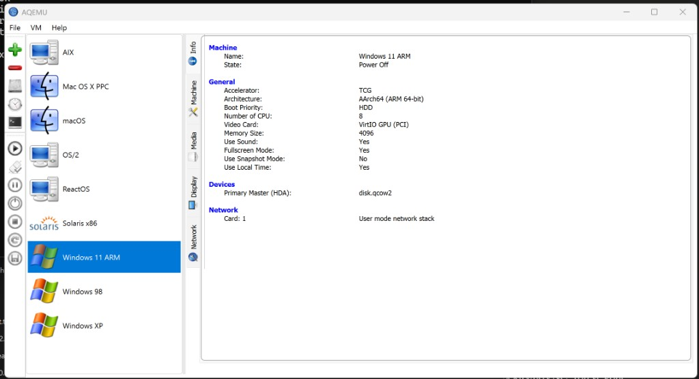
  <br/><i>AQEMU keeps the complete Windows 11 ARM machine profile visible: AArch64, TCG, VirtIO GPU, UEFI and lifecycle mode.</i>
</p>

---

## 🚀 Windows on ARM (WoA / Qualcomm Snapdragon Laptops)

AQEMU provides **first-class native ARM64 support for Windows on ARM (WoA)**, engineered specifically for modern Qualcomm Snapdragon laptops (such as **Snapdragon X Elite**, **Snapdragon X Plus**, and **Snapdragon 8cx Gen 2/3** devices like the Microsoft Surface Pro 11, Surface Laptop 7, Lenovo ThinkPad T14s Gen 6, Samsung Galaxy Book4 Edge, and HP EliteBook Ultra):

- **Pure Native ARM64 Execution**: No x86 translation overhead. AQEMU compiles and runs directly as an ARM64 binary with full native speed and responsiveness.
- **NEON Vector Optimizations**: Builds leverage `-DWIN_ARM64=1 -D_ARM64_=1` with AArch64 SIMD and Clang/LLVM `-O3` vectorization.
- **Embedded SPICE Display**: Native ARM64 `spice-client-glib-2.0` integration with automated LLVM runtime dependency bundling (`libunwind.dll`, `libc++.dll`).
- **Native Microsoft Store MSIX Packaging**: Generate signed, store-ready native ARM64 MSIX packages directly on Snapdragon devices using [`installer/build-msix.ps1`](installer/build-msix.ps1) or [`scripts/build_aqemu_woa.ps1`](scripts/build_aqemu_woa.ps1) (`-BuildMsix`).
- **Seamless MSYS2 CLANGARM64 Toolchain**: Compiles natively on ARM64 Windows using the MSYS2 `CLANGARM64` subsystem or cross-compiles using LLVM-MinGW (`generic-win-arm64.cmake`).
- **Dedicated Automated Build Scripts**:
  - PowerShell (Native Windows): [`scripts/build_aqemu_woa.ps1`](scripts/build_aqemu_woa.ps1)
  - MSYS2 CLANGARM64 (Bash): [`scripts/build_aqemu_woa.sh`](scripts/build_aqemu_woa.sh)

---

## 🍓 Raspberry Pi 5 Enhancements

AQEMU includes hardware-tailored enhancements specifically for the **Raspberry Pi 5** (Broadcom BCM2712 / quad-core ARM Cortex-A76) running 64-bit Raspberry Pi OS or Debian Bookworm:

- **Cortex-A76 Pipeline Tuning**: Compiled with `-mcpu=cortex-a76 -mtune=cortex-a76` and aggressive NEON floating-point vectorization for maximum performance.
- **64KB ELF Segment Alignment (`-Wl,-z,max-page-size=65536`)**: Standard 64-bit Raspberry Pi OS Bookworm kernels run with a **16KB memory page size**. AQEMU is built with 64KB ELF segment alignment to guarantee seamless binary loading, avoiding memory fault crashes or ELF alignment rejections on 16KB/64KB kernels.
- **KVM Near-Native Acceleration**: On Raspberry Pi 5 hosts, ARM64 guests (including Windows 11 ARM and Linux AArch64 distributions) utilize `/dev/kvm` hardware virtualization for near-bare-metal execution speeds.
- **Wayland & SPICE GTK Desktop Acceleration**: Built-in support for native Wayland sessions (`QT_QPA_PLATFORM=wayland`) and hardware-accelerated embedded SPICE display.
- **Dedicated Automated Build Script**:
  - Raspberry Pi 5 / Debian Bookworm: [`scripts/build_aqemu_pi5.sh`](scripts/build_aqemu_pi5.sh)

---

## ⚡ Reims vGPU Acceleration Engine (Linux / WSL)

AQEMU integrates **steelbrain's `qemu-reims-vgpu`** so Intel macOS guests can use Apple's built-in **`AppleParavirtGPU.kext`** with a host-side **Metal → Vulkan** translation path.

### Important (Windows hosts)
- Real Reims acceleration requires the **Linux** binary **`qemu-system-reims3d`** under **WSL** (with KVM + a working Vulkan/GL stack).
- The Windows `qemu-system-reimsvgpu.exe` helper is **not** a complete Reims build: it does **not** expose `reims-vgpu-pci`. AQEMU therefore **forces Launch via WSL** for Reims VMs and runs `/usr/local/bin/qemu-system-reims3d`.
- Build or install `qemu-system-reims3d` inside your WSL distro (typically `/usr/local/bin/qemu-system-reims3d`).
- **Display path:** early OpenCore/text stays in AQEMU’s **embedded VNC** (`-display none`). QEMU **SDL/GTK** (“Separate QEMU window”) is **unsupported** for Reims on WSL (libGL/DRI3 failures). The Reims **WSLg host window** (`REIMS_VGPU_WINDOW=1`) is **off by default**: Mesa Dozen on WSLg NVIDIA can segfault inside `vkCreateDevice` and kill QEMU — enable under Advanced Settings → WSL only to experiment.
- **Boot stack:** OSX-KVM `OVMF_CODE_4M`, `reims-vgpu-gop.rom` on the device, and OpenCore `reims-vgpu-efi.efi` (AQEMU installs the EFI driver into new/existing OpenCore FAT images when possible).
- **WSL Vulkan caveat:** WSLg exposes the GPU as **D3D12** (`/dev/dxg`). `nvidia-smi` can work while `vulkaninfo` only shows **llvmpipe** if Mesa **Dozen (`dzn` / `libvulkan_dzn`)** is missing. Stock Ubuntu often omits it.
- **Automatic provisioning:** Creating or starting a **Reims vGPU** VM on Windows runs `WSL_Ensure_Reims_Vulkan_Stack` inside the configured distro (via `wsl -u root` / optional remembered sudo). It installs **native-arch** Mesa Dozen only (never treats a foreign multiarch `libvulkan_dzn.so` as success), removes conflicting `mesa-vulkan-drivers:<foreign-arch>` packages, then verifies `vulkaninfo`.

### How Reims accelerates macOS graphics
- **Zero guest kext mods**: macOS already includes **`AppleParavirtGPU.kext`**. The Reims QEMU device presents the MMIO/IRQ shims that driver expects (`-device reims-vgpu-pci`).
- **Metal → Vulkan (`metal2vulkan`)**: guest Metal command streams are translated to host Vulkan.
- **No dGPU VFIO required** for the paravirtual path (separate from optional AMD Metal passthrough on bare-metal Linux).

### AQEMU integration
- Wizard profiles: **`macOS x86_64 vGPU (Reims)`** (and related Reims targets)
- Computer type: `qemu-system-reimsvgpu` (AQEMU label) → WSL launch of **`qemu-system-reims3d`**
- Defaults: q35, OpenCore/Intel macOS profile fields, `reims-vgpu-pci`, Launch via WSL enabled, embedded early-boot display

---

## 💾 Native 4096-Byte (4Kn) Sector Disks & TrueNAS / ZFS Emulation

**The 4096-byte (4Kn) native sector disk niche is a killer feature for AQEMU:**

- **VMware Workstation & VirtualBox**: Neither hypervisor supports native 4096-byte sector disks on standard virtual disks (they only emulate 512e / 512n).
- **Hyper-V**: Hyper-V only supports 4Kn disks if you convert them to proprietary `.vhdx` containers.
- **QEMU & AQEMU**: QEMU is the **only hypervisor** capable of natively emulating both 512B and 4096B logical and physical sector sizes across raw images, QCOW2 files, and VirtIO / NVMe / SCSI storage interfaces.

### Why this matters
Enterprise storage operating systems (such as **TrueNAS CORE**, **TrueNAS SCALE**, **FreeBSD**, and modern Linux distributions with native **ZFS pools**) frequently run on native 4Kn drives. When restoring or testing TrueNAS VM backups, other hypervisors fail because their virtual controllers force 512-byte logical sectors. 

1. **New VM Wizard**: Choose **TrueNAS CORE** or **TrueNAS SCALE** from the dedicated **TrueNAS / Storage** category (or under BSD/Linux) to automatically configure 4096-byte (4Kn) native sector size, 8 GB RAM, Q35 machine, VirtIO network, and VirtIO disk with 4K cluster alignment. Manual overrides for `Default (512n)`, `4Kn`, and `512e` are also available on both Typical and Custom storage pages.
2. **TrueNAS / ZFS Backup Import**: Attach existing disks directly in the wizard and immediately assign native 4096B sector size geometry without format conversion.
3. **QCOW2 4K Cluster Alignment**: When creating new disk images in the New VM Wizard or via **File → New Disk Image**, choose `4 KB (4Kn / ZFS Aligned)` cluster size to perfectly match 4Kn sectors and ZFS record sizes, eliminating write amplification.
4. **Properties Window**: Toggle or review sector formats (`512n`, `4Kn`, `512e`) directly on the **Hard Disk** properties tab with real-time bidirectional synchronization with Advanced Storage settings.
5. **Intelligent Bus Elevation & Safety**: Automatically elevates storage buses to VirtIO, NVMe, or SCSI for native 4Kn, while gracefully clamping legacy IDE controllers to 512e to prevent QEMU initialization crashes.

---

## 📦 Virtual Appliance Import & Export (OVA / OVF) & Universal Storage

### 📦 Seamless VirtualBox & VMware Interoperability
- **Direct `.ova` & `.ovf` Import**: Import virtual appliances from VirtualBox, VMware ESXi/Workstation, or cloud platforms directly via `File → Import Appliance (OVA / OVF)...` (`Ctrl+I`) or through Creation Method 6 in the New VM Wizard.
- **Built-in Pure C++ Streaming Parser**: Zero external runtime dependencies. Implements DMTF OVF 1.0 XML schema parsing, automated hardware translation (vCPU, memory, storage controllers, network interfaces), and streaming POSIX UStar TAR extraction.
- **Intelligent Profile Mapping**: Automatically maps VirtualBox and VMware guest OS identifiers to the closest of AQEMU's 195 tuned operating system profiles.
- **Format Conversion & 4Kn / Cluster Alignment**: Automatically converts VMDK disks to QCOW2 with optimal 4K cluster alignment or maintains native VMDK format based on user preference.
- **Export Virtual Appliances (`.ova`)**: Export any existing AQEMU VM to a standard `.ova` package (`File → Export Appliance (OVA)...` / `Ctrl+E`), converting disks to stream-optimized VMDKs and generating compliant DMTF OVF descriptors.

### 💽 Universal Multi-Disk & Multi-Optical Storage Overhaul
- **Unrestricted Multi-Disk Capacity**: The legacy limit of 4 hard disks and 1 CD-ROM has been completely eliminated across the entire application.
- **Modern Storage Buses**: Add arbitrary numbers of secondary disks and optical media attached to VirtIO, SATA/AHCI, SCSI, and NVMe controllers.
- **Universal Recognition**: Storage devices are seamlessly tracked across the Device Manager, VM Information tables, boot media validators, snapshot engines, and file cleanup dialogs.
- **Safe USB Passthrough**: Missing or unplugged host USB devices log non-blocking warnings instead of halting VM boot.

---

## 🖥️ Display Canvas Auto-Stretch & Dynamic Resolution Scaling

In AQEMU 1.3.1+, embedded SPICE and VNC sessions feature seamless auto-stretching:
- **No Letterboxing or Black Borders**: The guest display dynamically scales to fill the entire application canvas during window resize, maximize, and fullscreen transitions.
- **Dynamic In-Guest Resolution Changes**: In-guest resolution switches (e.g. from 640x480 boot splash to 1080p desktop) instantly propagate without requiring VM reboots or session reconnections.
- **Aspect Ratio & DPI Awareness**: Automatic coordinate translation ensures mouse and touch pointers maintain pixel-perfect precision across all scaling modes and HiDPI displays.

---

## 🔌 VMware-Style Physical USB Pass-Through & Hotplug

AQEMU now provides physical USB hardware redirection directly from the session toolbar while the VM is actively running:
- **Hotplug Physical Devices**: Redirect USB flash drives, external HDDs, Wi-Fi adapters, and host-based printers (e.g. DDST / GDI laser printers) straight into guest operating systems (such as Windows 10/11 running on a Raspberry Pi 5 or Windows PC).
- **Modern USB 3.0 XHCI Controller**: Automatically configures USB 3.0 XHCI virtualization (`aqemu_usb_hub.0`), replacing legacy EHCI/UHCI speed mismatch issues.
- **Safety Guardrails**: Prevents accidental redirection of the host's primary mouse or keyboard to avoid host lockouts.

---

## Windows from 1.x through modern

| Era | What AQEMU helps with |
|-----|------------------------|
| **Windows 1.x / 2.x / 3.x** | Period-friendly PC settings; treat them as real vintage targets |
| **Windows 95 / 98 / ME** | **Force pure TCG** (WHPX hangs classic 9x at splash), pentium2-class CPU, PS/2 or USB tablet guidance, cirrus-era video defaults |
| **NT / 2000 / XP / Vista / 7 / 10 / 11** | Modern q35 / virtio paths where appropriate; full device manager |
| **Windows 11 ARM** | Dedicated wizard + lifecycle modes, VirtIO, UEFI, embedded SPICE |

From **Win9x setup screens** to **Windows 11 ARM “Almost there”** — same app, same session chrome.

<p align="center">
  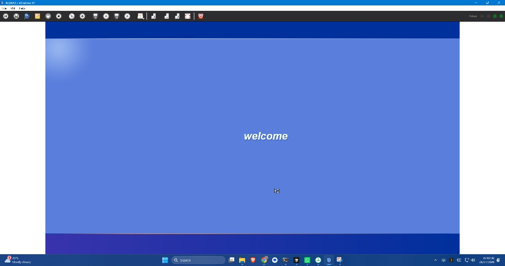
  <br/><i>Windows XP booting inside AQEMU's embedded session—vintage guests remain first-class targets.</i>
</p>

---

## Unix & other heavy guests

| Guest | Notes |
|-------|--------|
| **Solaris 11.4 x86** | Text installer ISO, `pc` + `usb=off`, e1000, IDE, WHPX/KVM on Windows; install can sit at 99% for a long time while the disk grows |
| **AIX (POWER)** | `qemu-system-ppc64` + `pseries` + POWER8, **TCG only** on x86 hosts (very slow). Virtio-SCSI. VMware VMDKs often fail under SLOF (`E3403 Bad executable`) — prefer a real AIX install ISO |
| **OS/2 / eComStation / ReactOS** | Proven IDE / ACPI-off / Force TCG style defaults in the wizard |
| **Linux / BSD / Haiku / …** | Full arch + machine pickers; VirtIO where it makes sense |

---

## Mac guests — classic and modern (bring your own media)

### Classic Mac OS (PowerPC)

- `qemu-system-ppc` + **mac99** (G3 beige still available in the machine list)
- Tuned RAM defaults (e.g. 256 MB for 7–9, 512 MB for OS X PPC)
- New-World-friendly NIC hints (`sungem` / macio when probed), screamer audio hint, machine-native video
- **You supply** the boot CD/ISO or HDD image — we never ship Apple install media
- Clear warning if `qemu-system-ppc` isn’t installed

<p align="center">
  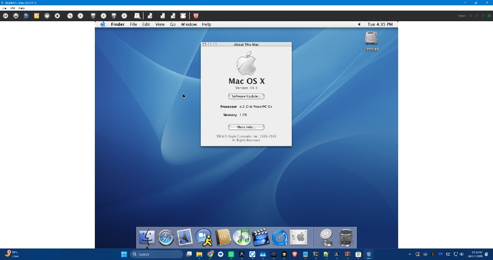
  <br/><i>Mac OS X Tiger on an emulated PowerPC G4, running inside AQEMU on Windows.</i>
</p>

### Intel macOS / Darwin (experimental)

- `qemu-system-x86_64`, **q35**, dual-pflash **OVMF**, OpenCore as first disk, Apple SMC **only if you paste your own OSK**
- Optional Recovery/BaseSystem path
- Native **WHPX** on Windows, or **WSL/KVM** when `/dev/kvm` works (`wsl.exe` + Linux QEMU, SPICE still on localhost)
- Host-matching resolution via OpenCore; AMD Metal passthrough UI on bare-metal Linux (see [`docs/intel-macos-gpu.md`](docs/intel-macos-gpu.md))
- **AQEMU does not ship** OpenCore, OVMF bundles as Apple IP, OS images, or a pre-filled OSK

<p align="center">
  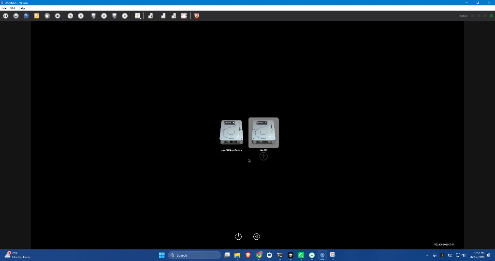
  <br/><i>OpenCore boot selection inside AQEMU—users provide their own lawful OpenCore, firmware and macOS media.</i>
</p>

<p align="center">
  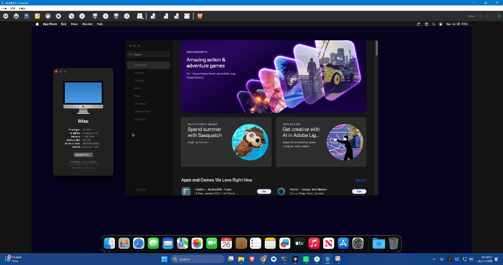
  <br/><i>Intel macOS Sonoma running as an experimental AQEMU guest, with the AQEMU session toolbar still visible.</i>
</p>

### Out of scope (for now)

Apple Silicon macOS guests on Snapdragon Windows hosts — not this release’s promise. Everything else QEMU can express stays on the table via architecture / machine pickers.

---

## Apple Silicon (macOS ARM64) — experimental

iOS on Windows 11 is documented **[above](#ios-on-windows-11)** (screenshots, iOS 14 tested, install steps).

The same Inferno binary can target **macOS Apple Silicon (ARM64)** in the wizard. Do not expect M1/`t8101` unless your `qemu-system-applesoc` lists it in `-machine help`. AQEMU does **not** ship IPSW files, kernels, DeviceTrees, SHSH/`ticket.shsh2`, or Apple OS images.

---

## Screenshots

More of the guest zoo — Win11 ARM and classic Windows under the same session UI. (Sonoma teaser is at the top of this README.)

**Windows 11 ARM** running *inside* AQEMU on a Windows host — embedded SPICE session, full toolbar, guest progressing through setup:

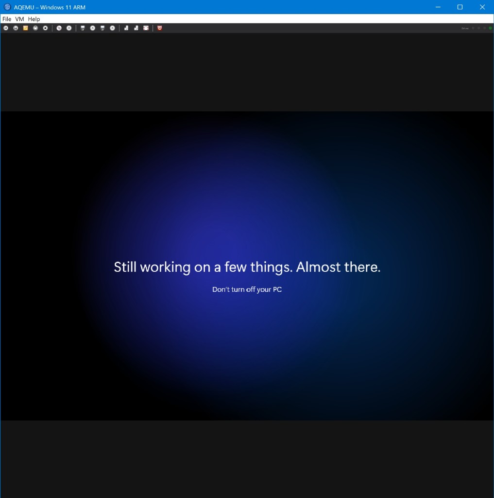

**Windows 98** install under the same modern UI — classic guests are first-class, not an afterthought:


**Session chrome** — boot console / toolbar while QEMU runs headless behind SPICE:

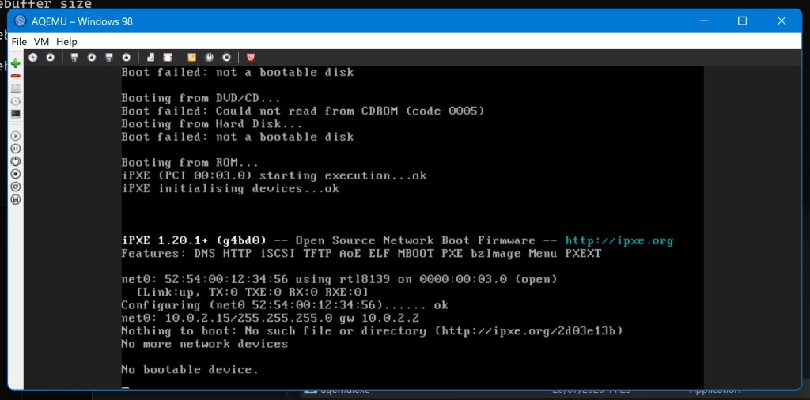

### 🛠️ Overhauled VM Creation Wizard (5 Creation Paths & 29 QEMU Targets)

**1. Creation Method** — Six paths: Guest OS, System/Board Platform, CPU Architecture, Custom/Advanced, Import Existing Disk, or Import Virtual Appliance (OVA / OVF):

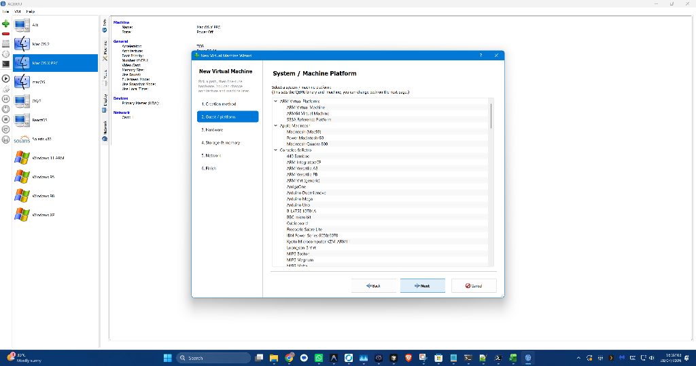

**2. System / Machine Platform** — Categorized boards and hardware platforms (ARM Virt, Apple PowerMac, Sun SPARCstation, Retro/SBCs):

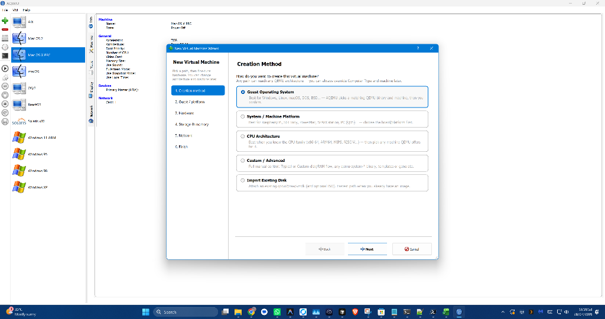

**3. CPU Architecture** — Direct access to all 29 QEMU target executables (x86_64, aarch64, ppc64, riscv64, s390x, sparc, mips, alpha, hppa...):

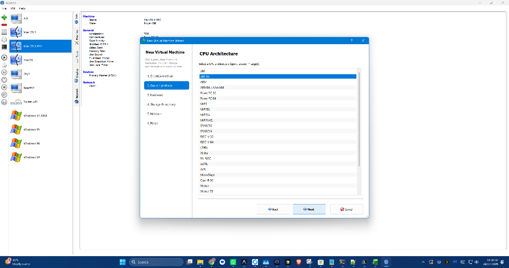

**4. Machine Selection & Ground-Truth Catalog** — Probe-driven machine selection with recommended defaults and complete QEMU machine catalogs:

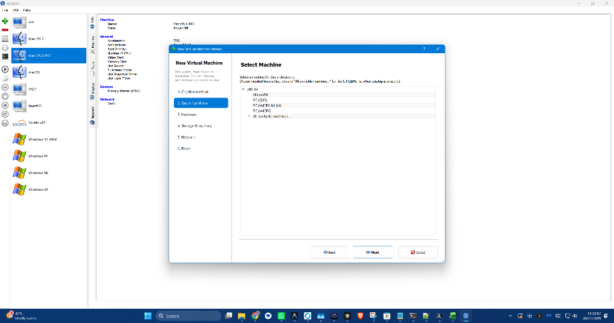

More captures live in [`screenshots/`](screenshots/).

---

## Built-in QEMU 11.0.2

Optional **git submodule** pins upstream QEMU at **v11.0.2** (`third_party/qemu`). Build scripts for Linux/Pi and Windows produce an install tree you can **bundle next to AQEMU** (`AQEMU_BUNDLE_QEMU=ON`).

One frontend. Current QEMU. Your guests.

Details: [`third_party/README.md`](third_party/README.md).

---

## Feature highlights

- **Beyond Tobias Gläßer’s 0.9.x** — 118,707 additions across 416 files and 197 commits ([compare](https://github.com/tobimensch/aqemu/compare/master...chronic8000:aqemu:master))
- **Ground-truth catalogs** — 28 probed architectures, 490 machines, 2,074 CPUs, 604 NICs and 194 displays
- **Six-path wizard** — 195 curated guest profiles, plus system, architecture, custom, disk-import, and OVA/OVF flows
- **QEMU installation** — **Use built-in QEMU** (portable zip) or **custom folder**
- **Embedded SPICE/VNC + QMP** session UI (CD/FD/HDD/USB hotplug/net toolbar while the guest runs)
- **Full architecture discovery** — 29 selectable QEMU targets plus live `qemu-system-*` discovery
- **Windows 11 ARM** guided install / first boot / normal modes
- **Force pure TCG** for pre-ME Windows that WHPX breaks
- **Classic PPC Mac** + **experimental Intel macOS** (OpenCore / WSL-KVM)
- **Solaris / AIX / OS/2 / ReactOS** wizard defaults that match real QEMU recipes
- **Advanced QEMU options** — NUMA, TPM, migrate, SMBIOS, fw_cfg, blockdev graph, …
- **WSL/KVM launch** path on Windows (probe `/dev/kvm` in Settings)
- **Native 4096-Byte (4Kn) Sector Disks** — First-class emulation for 4Kn native sector disks and 512e across VirtIO, NVMe, and SCSI. A killer capability missing in VMware Workstation and VirtualBox, making AQEMU the premier hypervisor for running TrueNAS and ZFS VM backups.
- **QCOW2 4K Cluster Alignment** — Create disk images with 4 KB cluster size alignment directly from the wizard or File menu to eliminate write amplification on 4Kn / ZFS workloads.
- **Embedded Display Canvas Auto-Stretch** — Seamless full-canvas stretching without letterboxing, maintaining crisp aspect rendering and immediate adaptation to dynamic in-guest resolution changes.
- **VMware-Style USB Passthrough** — Hotplug host physical USB hardware (printers, flash drives, security dongles) directly into running guests via the session toolbar with modern XHCI 3.0 controller support.
- **Pi 5** optimizations (`-mcpu=cortex-a76`, 64KB page alignment, Wayland)
- **QEMU Lab (1.5.2)** — port table, support bundle, snapshot timeline, Chain Studio, virtiofs when the host has it, and bring-your-own wraps. Guide: [`docs/LAB_1.5.2.md`](docs/LAB_1.5.2.md)
- **Microsoft Store–ready** posture: GPLv2 source public, [privacy policy](PRIVACY.md), no proprietary OS media in the box

---

## License & what we never ship

**GNU GPL version 2** — [`LICENSE`](LICENSE). Selling installers (Store, itch, Releases) is allowed; source for those binaries is this repo.

We **never** ship:

- Windows ISOs / product keys  
- Apple OS / recovery / BaseSystem / IPSW  
- OpenCore images  
- A default Apple **OSK**
- Xbox MCPX, BIOS, HDD, DVD, or EEPROM
- Android system images
- IBM AIX / Oracle Solaris media

You point at files you obtained lawfully.

**Trademarks:** Microsoft, Windows, Apple, macOS, IBM, Oracle, etc. belong to their owners. AQEMU is independent and not endorsed by Microsoft, Apple, IBM, Oracle, or the QEMU project.

---

## Install

### Microsoft Store (Windows)

Get the official **AQEMU VM Manager** package on the Microsoft Store:

<p align="center">
  <a href="ms-windows-store://pdp/?productid=9P0HGKHQ9W19">
    <b>👉 Open in Microsoft Store app (`ms-windows-store://pdp/?productid=9P0HGKHQ9W19`)</b>
  </a><br/>
  <a href="https://apps.microsoft.com/detail/9p0hgkhq9w19">
    <b>🌐 View on Web (`https://apps.microsoft.com/detail/9p0hgkhq9w19`)</b>
  </a>
</p>

This repository builds **AQEMU 1.5.2**. A Store install includes:
- Apple SoC (Inferno/iOS) and the existing Reims path via WSL
- **Bundled QEMU 11.0.2** binaries (no separate QEMU setup required)
- **Automatic background updates** via the Microsoft Store
- Dedicated Windows app installation & single-click launcher
- **AMD and NVIDIA** GPU acceleration for Reims guests through WSLg Vulkan (WSL required)

### Build from Source (Linux / Pi 5 / Windows x64 & ARM64)

AQEMU is 100% open-source software under **GPLv2**. Automated, dedicated build scripts are provided in the [`scripts/`](scripts/) directory for every supported platform.

---

## Build

### 1. Raspberry Pi 5 (ARM64 / Raspberry Pi OS / Debian)

AQEMU provides a dedicated build script [`scripts/build_aqemu_pi5.sh`](scripts/build_aqemu_pi5.sh) configured with Cortex-A76 tuning, 64KB ELF segment alignment (for 16KB-page kernels), and embedded SPICE GTK.

**Install dependencies (Debian / Raspberry Pi OS 64-bit):**
```bash
sudo apt update
sudo apt install -y build-essential cmake ninja-build pkg-config \
  qtbase5-dev libqt5widgets5 libqt5network5 libqt5dbus5 libvncserver-dev \
  libspice-client-glib-2.0-dev libslirp-dev libusb-1.0-0-dev qemu-system qemu-utils
```

**Build with the dedicated script:**
```bash
git clone --recursive https://github.com/chronic8000/aqemu.git
cd aqemu
./scripts/build_aqemu_pi5.sh

# Run AQEMU (Wayland or X11)
QT_QPA_PLATFORM=wayland ./build_pi5/aqemu
# Or install into ~/.local:
./scripts/build_aqemu_pi5.sh --install
```

---

### 2. Windows on ARM (WoA / Qualcomm Snapdragon Laptops)

For native ARM64 Windows builds on Qualcomm Snapdragon laptops (Snapdragon X Elite, X Plus, 8cx) using MSYS2:

#### Option A: MSYS2 CLANGARM64 Bash (Recommended on Snapdragon)
Open the **MSYS2 CLANGARM64** terminal on your Snapdragon laptop:
```bash
git clone --recursive https://github.com/chronic8000/aqemu.git
cd aqemu

# Install required CLANGARM64 dependencies and build:
./scripts/build_aqemu_woa.sh --deps

# Run native ARM64 AQEMU:
./build_woa/aqemu.exe
```

> **Note on MSYS2 downloads:** If MSYS2 mirrors experience transient connection timeouts during package downloads, simply re-run `./scripts/build_aqemu_woa.sh --deps`. Pacman caches all completed packages in `/var/cache/pacman/pkg/` and will seamlessly resume downloading only the remaining packages without starting over. The script also automatically disables the default 10-second download timeout in `/etc/pacman.conf`.

#### Option B: Native PowerShell
From standard PowerShell (with MSYS2 installed at `C:\msys64`):
```powershell
git clone --recursive https://github.com/chronic8000/aqemu.git
cd aqemu

# Build native ARM64 binary:
.\scripts\build_aqemu_woa.ps1

# Optional: Build and package a native ARM64 Microsoft Store MSIX:
.\scripts\build_aqemu_woa.ps1 -BuildMsix
```

---

### 3. Windows x86_64

For 64-bit Intel/AMD Windows PCs using MSYS2 UCRT64 or WinLibs:

#### Option A: MSYS2 UCRT64 Bash
Open the **MSYS2 UCRT64** terminal:
```bash
git clone --recursive https://github.com/chronic8000/aqemu.git
cd aqemu

# Install dependencies and build:
./scripts/build_aqemu_win64.sh --deps

# Run:
./build_win64/aqemu.exe
```

#### Option B: Native PowerShell
From standard PowerShell:
```powershell
# Build x86_64 binary:
.\scripts\build_aqemu_win64.ps1

# Optional: package as MSIX:
.\scripts\build_aqemu_win64.ps1 -BuildMsix
```

---

### 4. Linux x86_64

AQEMU provides a dedicated build script [`scripts/build_aqemu_linux_x86_64.sh`](scripts/build_aqemu_linux_x86_64.sh):

```bash
sudo apt update
sudo apt install -y build-essential cmake ninja-build pkg-config \
  qtbase5-dev libqt5widgets5 libvncserver-dev extra-cmake-modules \
  libspice-client-glib-2.0-dev libslirp-dev libusb-1.0-0-dev qemu-system qemu-utils

git clone --recursive https://github.com/chronic8000/aqemu.git
cd aqemu
./scripts/build_aqemu_linux_x86_64.sh

# Run:
./build_linux/aqemu
# Or install to ~/.local:
./scripts/build_aqemu_linux_x86_64.sh --install
```

---

### 5. Compiling QEMU 11.0.2 & Bundling with AQEMU

Dedicated QEMU build scripts are provided for every host platform, with full AQEMU feature parity (SLIRP user networking, embedded SPICE & VNC displays, USB redirection, curl, and native acceleration):

#### Host-Specific QEMU Build Scripts:
- **Raspberry Pi 5 (ARM64 Cortex-A76 + 64KB page alignment):**
  ```bash
  ./scripts/build_qemu_pi5.sh                 # Builds all targets
  ./scripts/build_qemu_pi5.sh aarch64         # Builds qemu-system-aarch64 only
  ```
- **Linux ARM64 / AArch64:**
  ```bash
  ./scripts/build_qemu_linux_arm64.sh [TARGET]
  ```
- **Linux x86_64:**
  ```bash
  ./scripts/build_qemu_linux_x86_64.sh [TARGET]
  ```
- **Windows on ARM (Snapdragon laptops via MSYS2 CLANGARM64):**
  ```bash
  ./scripts/build_qemu_win_arm64.sh [TARGET]
  # Or via PowerShell: .\scripts\build_qemu_win_arm64.ps1 -Target aarch64
  ```
- **Windows x86_64 (MSYS2 UCRT64 / MinGW64):**
  ```bash
  ./scripts/build_qemu_win_x86_64.sh [TARGET]
  # Or via PowerShell: .\scripts\build_qemu_win_x86_64.ps1 -Target x86_64
  ```

#### Individual Architecture & Target Scripts (`scripts/qemu_targets/`):
Dedicated standalone build scripts are provided for **all 31 supported target architectures**, including upstream QEMU targets plus **ChefKiss Inferno** and **steelbrain Reims vGPU**:

| Target Script | Target Emulator Binary | Target Description |
|:---|:---|:---|
| [`build_qemu_x86_64.sh`](scripts/qemu_targets/build_qemu_x86_64.sh) | `qemu-system-x86_64` | Intel / AMD 64-bit PC |
| [`build_qemu_i386.sh`](scripts/qemu_targets/build_qemu_i386.sh) | `qemu-system-i386` | Intel / AMD 32-bit PC |
| [`build_qemu_aarch64.sh`](scripts/qemu_targets/build_qemu_aarch64.sh) | `qemu-system-aarch64` | ARM 64-bit (ARMv8/v9) |
| [`build_qemu_arm.sh`](scripts/qemu_targets/build_qemu_arm.sh) | `qemu-system-arm` | ARM 32-bit |
| [`build_qemu_applesoc.sh`](scripts/qemu_targets/build_qemu_applesoc.sh) | `qemu-system-applesoc` | **ChefKiss Inferno** (iOS / Apple Silicon A13/t8030) |
| [`build_qemu_reims.sh`](scripts/qemu_targets/build_qemu_reims.sh) | `qemu-system-reims3d` | **steelbrain Reims vGPU** (macOS Metal → Vulkan paravirtualization) |
| [`build_qemu_ppc64.sh`](scripts/qemu_targets/build_qemu_ppc64.sh) | `qemu-system-ppc64` | PowerPC 64-bit (PowerNV, pSeries) |
| [`build_qemu_ppc.sh`](scripts/qemu_targets/build_qemu_ppc.sh) | `qemu-system-ppc` | PowerPC 32-bit (Mac G3/G4, PREP) |
| [`build_qemu_riscv64.sh`](scripts/qemu_targets/build_qemu_riscv64.sh) | `qemu-system-riscv64` | RISC-V 64-bit |
| [`build_qemu_riscv32.sh`](scripts/qemu_targets/build_qemu_riscv32.sh) | `qemu-system-riscv32` | RISC-V 32-bit |
| [`build_qemu_mips64el.sh`](scripts/qemu_targets/build_qemu_mips64el.sh) | `qemu-system-mips64el` | MIPS 64-bit Little Endian |
| [`build_qemu_mips64.sh`](scripts/qemu_targets/build_qemu_mips64.sh) | `qemu-system-mips64` | MIPS 64-bit Big Endian |
| [`build_qemu_mipsel.sh`](scripts/qemu_targets/build_qemu_mipsel.sh) | `qemu-system-mipsel` | MIPS 32-bit Little Endian |
| [`build_qemu_mips.sh`](scripts/qemu_targets/build_qemu_mips.sh) | `qemu-system-mips` | MIPS 32-bit Big Endian |
| [`build_qemu_s390x.sh`](scripts/qemu_targets/build_qemu_s390x.sh) | `qemu-system-s390x` | IBM S390x Mainframe |
| [`build_qemu_sparc64.sh`](scripts/qemu_targets/build_qemu_sparc64.sh) | `qemu-system-sparc64` | SPARC 64-bit |
| [`build_qemu_sparc.sh`](scripts/qemu_targets/build_qemu_sparc.sh) | `qemu-system-sparc` | SPARC 32-bit |
| [`build_qemu_m68k.sh`](scripts/qemu_targets/build_qemu_m68k.sh) | `qemu-system-m68k` | Motorola 68000 / ColdFire |
| [`build_qemu_loongarch64.sh`](scripts/qemu_targets/build_qemu_loongarch64.sh) | `qemu-system-loongarch64` | LoongArch 64-bit |
| [`build_qemu_alpha.sh`](scripts/qemu_targets/build_qemu_alpha.sh) | `qemu-system-alpha` | DEC Alpha Server |
| [`build_qemu_hppa.sh`](scripts/qemu_targets/build_qemu_hppa.sh) | `qemu-system-hppa` | HP PA-RISC |
| [`build_qemu_sh4.sh`](scripts/qemu_targets/build_qemu_sh4.sh) | `qemu-system-sh4` | SuperH SH-4 |
| [`build_qemu_sh4eb.sh`](scripts/qemu_targets/build_qemu_sh4eb.sh) | `qemu-system-sh4eb` | SuperH SH-4 Big Endian |
| [`build_qemu_microblaze.sh`](scripts/qemu_targets/build_qemu_microblaze.sh) | `qemu-system-microblaze` | Xilinx MicroBlaze |
| [`build_qemu_microblazeel.sh`](scripts/qemu_targets/build_qemu_microblazeel.sh) | `qemu-system-microblazeel` | Xilinx MicroBlaze Little Endian |
| [`build_qemu_or1k.sh`](scripts/qemu_targets/build_qemu_or1k.sh) | `qemu-system-or1k` | OpenRISC 1000 |
| [`build_qemu_rx.sh`](scripts/qemu_targets/build_qemu_rx.sh) | `qemu-system-rx` | Renesas RX |
| [`build_qemu_avr.sh`](scripts/qemu_targets/build_qemu_avr.sh) | `qemu-system-avr` | AVR Microcontroller |
| [`build_qemu_tricore.sh`](scripts/qemu_targets/build_qemu_tricore.sh) | `qemu-system-tricore` | Infineon TriCore |
| [`build_qemu_xtensa.sh`](scripts/qemu_targets/build_qemu_xtensa.sh) | `qemu-system-xtensa` | Tensilica Xtensa |
| [`build_qemu_xtensaeb.sh`](scripts/qemu_targets/build_qemu_xtensaeb.sh) | `qemu-system-xtensaeb` | Tensilica Xtensa Big Endian |

To build all 31 individual targets in batch:
```bash
./scripts/qemu_targets/build_all_targets.sh
```

#### Bundling with AQEMU:
Once built, configure AQEMU with the bundle prefix:
```bash
cmake -B build -G Ninja -DAQEMU_BUNDLE_QEMU=ON -DAQEMU_QEMU_PREFIX=$PWD/third_party/qemu-install
ninja -C build
```

### 6. CMake Options Reference

| CMake Option | Default | Description |
|--------------|---------|-------------|
| `AQEMU_WITH_SPICE_GTK` | `ON` | Embedded SPICE client display support (`spice-client-glib-2.0`) |
| `WIN_ARM64_OPTIMIZATIONS` | `OFF` (auto-detected on ARM64) | Enables native Windows on ARM (WoA / Snapdragon) `-DWIN_ARM64=1` and `-O3` optimizations |
| `PI5_OPTIMIZATIONS` | `OFF` | Enables Raspberry Pi 5 Cortex-A76 tuning and 64KB ELF segment alignment |
| `WITHOUT_EMBEDDED_DISPLAY` | `OFF` | Disable embedded display engines (LibVNC / SPICE) |
| `AQEMU_BUNDLE_QEMU` | `OFF` | Copy bundled QEMU 11.0.2 binaries and firmware beside AQEMU executable |
| `AQEMU_QEMU_PREFIX` | `""` | Source prefix path for bundled QEMU binaries |

---

## Credits

- **Current maintainers:** Chronic Engineering  
- **Prior community maintainer:** Tobias Gläßer (0.9.x)  
- **Original author:** Andrey Rijov (RDron)  

Full contributor list: **Help → About → Thanks To**.

---

## Troubleshooting

- **Win11 ARM on x86 Windows** = TCG only → give it RAM + 4 vCPUs and patience; it’s usable, not native-ARM fast  
- **Win95/98 splash freeze** → enable **Force pure TCG**  
- **Classic Mac won’t start** → install `qemu-system-ppc` and attach your own ISO/HDD  
- **Intel macOS** → your OpenCore + OVMF + OSK; empty OSK refuses to start (by design)  
- **Solaris 11.4 “stuck”** → often still installing; watch the disk image grow; use text ISO + WHPX/KVM  
- **AIX on Windows** → PPC is TCG-only; dead keyboard at OF prompt usually means console was forced to serial VTY while you typed in the VGA window  
- **AIX `E3403 Bad executable`** → disk is not a QEMU/SLOF-bootable AIX image (common with VMware VMDKs)  
- **Guest disk locked on Windows** → end stray `qemu-system-*` in Task Manager, restart AQEMU  
- **Clipboard host↔guest** → real sync needs SPICE + `spice-vdagent` *in the guest*; AIX/SLOF and many vintage guests will not do that  

Questions and patches: [GitHub Issues](https://github.com/chronic8000/aqemu/issues) / PRs welcome.
